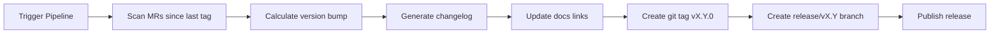
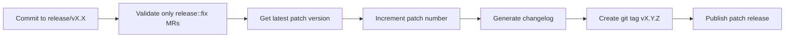
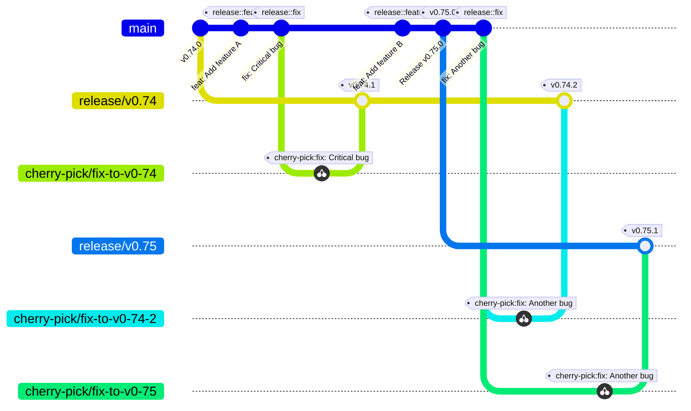
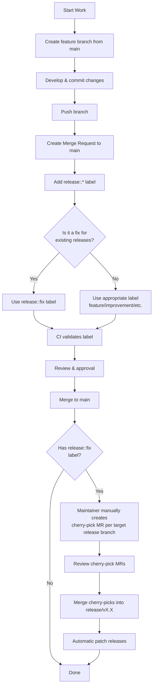
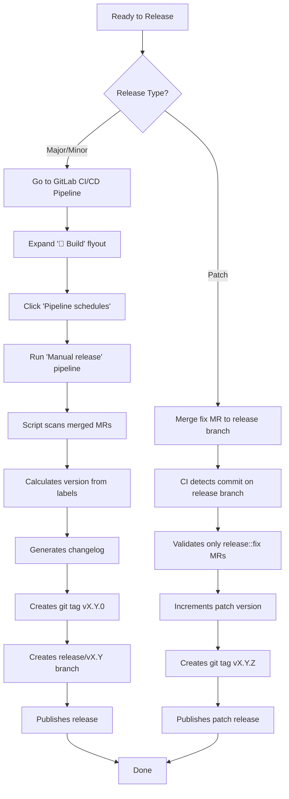
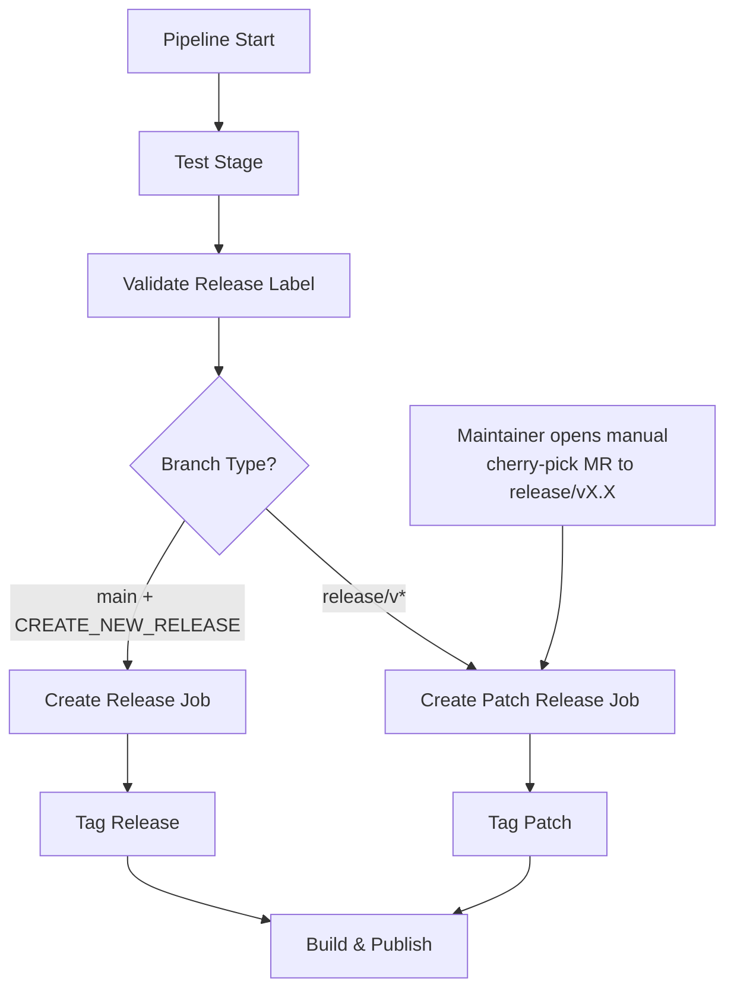

# DataEval Branching and Release Strategy

DataEval follows **GitLab Flow with Release Branches**, enhanced with label-driven semantic versioning.

## Table of Contents

- [Overview](#overview)
- [Branch Structure](#branch-structure)
- [Release Process](#release-process)
- [Release Labels](#release-labels)
- [Workflows](#workflows)
- [Automation](#automation)
- [Version Management](#version-management)

## Overview

Our branching strategy balances the simplicity of trunk-based development with the need to maintain multiple
production release versions. All development flows through the `main` branch, while long-lived `release/vX.X`
branches enable ongoing patch support for deployed versions.

### Key Principles

- **Single source of truth**: All features and fixes merge to `main` first
- **Semantic versioning**: Clear version increments based on change type
- **Manual hotfix propagation**: Maintainers cherry-pick fixes from `main` into release branches via MR
- **Label-driven releases**: MR labels determine release type and changelog categorization

## Branch Structure

### Primary Branches

| Branch         | Purpose                                                            | Lifetime   | Protected |
| -------------- | ------------------------------------------------------------------ | ---------- | --------- |
| `main`         | Primary development branch, always releasable                      | Permanent  | Yes       |
| `release/vX.X` | Maintenance branch for major.minor version (e.g., `release/v0.74`) | Long-lived | Yes       |

### Temporary Branches

| Branch Pattern             | Purpose                            | Lifetime    | Creator    |
| -------------------------- | ---------------------------------- | ----------- | ---------- |
| `feature/*`, `fix/*`, etc. | Feature/fix development branches   | Short-lived | Developers |
| `cherry-pick/fix-to-X-X`   | Manual hotfix cherry-pick branches | Short-lived | Maintainer |

### Branch Naming Conventions

While not strictly enforced, we recommend the following patterns for clarity:

- **Features**: `feature/<description>` or `<username>/<description>`
- **Bug fixes**: `fix/<issue-number>-<description>` or `<username>/<description>`
- **Documentation**: `docs/<description>`
- **Chores**: `chore/<description>`

## Release Process

### Release Types

We support three types of releases, each with different triggers and processes:

#### 1. Major/Minor Releases (from `main`)

**Purpose**: New features, improvements, deprecations, or breaking changes

**Trigger**: Manual pipeline execution with `CREATE_NEW_RELEASE=true` variable

**Process**:


```mermaid
graph LR
    A[Trigger Pipeline] --> B[Scan MRs since last tag]
    B --> C[Calculate version bump]
    C --> D[Generate changelog]
    D --> E[Update docs links]
    E --> F[Create git tag vX.Y.0]
    F --> G[Create release/vX.Y branch]
    G --> H[Publish release]
```

**Script**: [`.gitlab/scripts/create_release.py`](.gitlab/scripts/create_release.py)

**Version Increment**:

- `release::major` → MAJOR version bump (e.g., v0.74.0 → v1.0.0)
- `release::feature` → MINOR version bump (e.g., v0.74.0 → v0.75.0)
- `release::improvement` → MINOR version bump
- `release::deprecation` → MINOR version bump

#### 2. Patch Releases (from `release/vX.X`)

**Purpose**: Bug fixes to existing releases

**Trigger**: Automatic on any commit to `release/v*` branches

**Process**:


```mermaid
graph LR
    A[Commit to release/vX.X] --> B[Validate only release::fix MRs]
    B --> C[Get latest patch version]
    C --> D[Increment patch number]
    D --> E[Generate changelog]
    E --> F[Create git tag vX.Y.Z]
    F --> G[Publish patch release]
```

**Script**: [`.gitlab/scripts/create_patch_release.py`](.gitlab/scripts/create_patch_release.py)

**Version Increment**: Patch version only (e.g., v0.74.2 → v0.74.3)

**Constraints**:

- Only `release::fix` labeled MRs allowed on release branches
- No features or breaking changes permitted

#### 3. Hotfix Cherry-Pick (from `main` to releases)

**Purpose**: Distribute critical fixes to active release branches

**Trigger**: Manual. After a `release::fix` MR merges to `main`, a maintainer decides which release branches need the
fix.

**Process**:


```mermaid
graph LR
    A[Fix merged to main] --> B[Maintainer identifies target release branches]
    B --> C[For each target release branch]
    C --> D[Create cherry-pick/fix-to-X-X branch from release/vX.X]
    D --> E[git cherry-pick commit]
    E --> F[Resolve conflicts if any]
    F --> G[Push branch & open MR to release/vX.X]
    G --> H[Review & merge]
    H --> I[Automatic patch release]
```

**Example commands**:

```bash
git fetch origin
git checkout -b cherry-pick/fix-to-v0-74 origin/release/v0.74
git cherry-pick <commit-sha>
# resolve conflicts if needed, then:
git push -u origin cherry-pick/fix-to-v0-74
# open MR targeting release/v0.74 with release::fix label
```

**Manual Step**: Maintainers create the cherry-pick branch, open the MR, and merge it. The resulting commit on
`release/vX.X` triggers the automatic patch release.

## Release Labels

Every merge request to `main` **must** have exactly one `release::*` label. This requirement is enforced by CI validation.

### Available Labels

| Label                  | Version Bump  | Use Case                             | Changelog Section |
| ---------------------- | ------------- | ------------------------------------ | ----------------- |
| `release::major`       | MAJOR (X.0.0) | Breaking changes, major API overhaul | Breaking Changes  |
| `release::feature`     | MINOR (0.X.0) | New features, new capabilities       | Features          |
| `release::improvement` | MINOR (0.X.0) | Enhancements to existing features    | Improvements      |
| `release::deprecation` | MINOR (0.X.0) | Deprecating functionality            | Deprecations      |
| `release::fix`         | PATCH (0.0.X) | Bug fixes, minor improvements        | Bug Fixes         |
| `release::misc`        | None          | Documentation, CI, refactoring       | Miscellaneous     |

### Label Selection Guide

**Choose `release::fix` when**:

- Fixing a bug that affects existing releases
- Correcting incorrect behavior
- Patching security vulnerabilities
- The fix is a candidate for manual cherry-pick into active release branches

**Choose `release::feature` when**:

- Adding new functionality
- Introducing new APIs or modules
- Adding new configuration options

**Choose `release::improvement` when**:

- Enhancing existing features
- Optimizing performance
- Improving error messages or logging

**Choose `release::misc` when**:

- Updating documentation only
- Changing CI/CD configuration
- Internal refactoring with no behavior change
- Updating dependencies without feature changes

## Workflows

### Complete Release Flow Diagram


```mermaid
gitGraph
    commit id: "v0.74.0"
    branch "release/v0.74"
    checkout main
    commit id: "feat: Add feature A" tag: "release::feature"
    commit id: "fix: Critical bug" tag: "release::fix"
    branch "cherry-pick/fix-to-v0-74"
    checkout "cherry-pick/fix-to-v0-74"
    cherry-pick id: "fix: Critical bug"
    checkout "release/v0.74"
    merge "cherry-pick/fix-to-v0-74" tag: "v0.74.1"
    checkout main
    commit id: "feat: Add feature B" tag: "release::feature"
    commit id: "Release v0.75.0" tag: "v0.75.0"
    branch "release/v0.75"
    checkout main
    commit id: "fix: Another bug" tag: "release::fix"
    branch "cherry-pick/fix-to-v0-74-2"
    branch "cherry-pick/fix-to-v0-75"
    checkout "cherry-pick/fix-to-v0-74-2"
    cherry-pick id: "fix: Another bug"
    checkout "release/v0.74"
    merge "cherry-pick/fix-to-v0-74-2" tag: "v0.74.2"
    checkout "cherry-pick/fix-to-v0-75"
    cherry-pick id: "fix: Another bug"
    checkout "release/v0.75"
    merge "cherry-pick/fix-to-v0-75" tag: "v0.75.1"
```

### Developer Workflow


```mermaid
flowchart TD
    A[Start Work] --> B[Create feature branch from main]
    B --> C[Develop & commit changes]
    C --> D[Push branch]
    D --> E[Create Merge Request to main]
    E --> F[Add release::* label]
    F --> G{Is it a fix for<br/>existing releases?}
    G -->|Yes| H[Use release::fix label]
    G -->|No| I[Use appropriate label<br/>feature/improvement/etc.]
    H --> J[CI validates label]
    I --> J
    J --> K[Review & approval]
    K --> L[Merge to main]
    L --> M{Has release::fix<br/>label?}
    M -->|Yes| N[Maintainer manually creates<br/>cherry-pick MR per target release branch]
    M -->|No| O[Done]
    N --> P[Review cherry-pick MRs]
    P --> Q[Merge cherry-picks into release/vX.X]
    Q --> R[Automatic patch releases]
    R --> O
```

### Maintainer Workflow: Creating a Release


```mermaid
flowchart TD
    A[Ready to Release] --> B{Release Type?}
    B -->|Major/Minor| C[Go to GitLab CI/CD Pipeline]
    B -->|Patch| D[Merge fix MR to release branch]
    C --> E["Expand '🚀 Build' flyout"]
    E --> F[Click 'Pipeline schedules']
    F --> G[Run 'Manual release' pipeline]
    G --> H[Script scans merged MRs]
    H --> I[Calculates version from labels]
    I --> J[Generates changelog]
    J --> K[Creates git tag vX.Y.0]
    K --> L[Creates release/vX.Y branch]
    L --> M[Publishes release]
    M --> N[Done]
    D --> O[CI detects commit on release branch]
    O --> P[Validates only release::fix MRs]
    P --> Q[Increments patch version]
    Q --> R[Creates git tag vX.Y.Z]
    R --> S[Publishes patch release]
    S --> N
```

## Automation

Our release process is highly automated through GitLab CI/CD pipelines.

### Automated Scripts

All automation scripts are located in [`.gitlab/scripts/`](.gitlab/scripts/):

| Script                                                                   | Purpose                        | Trigger                           |
| ------------------------------------------------------------------------ | ------------------------------ | --------------------------------- |
| [`create_release.py`](.gitlab/scripts/create_release.py)                 | Create major/minor releases    | Manual: `CREATE_NEW_RELEASE=true` |
| [`create_patch_release.py`](.gitlab/scripts/create_patch_release.py)     | Create patch releases          | Auto: Commit to `release/v*`      |
| [`validate_release_label.py`](.gitlab/scripts/validate_release_label.py) | Ensure MRs have release labels | Auto: All MRs to main             |
| [`releasegen.py`](.gitlab/scripts/releasegen.py)                         | Core release logic & changelog | Called by release scripts         |
| [`versiontag.py`](.gitlab/scripts/versiontag.py)                         | Version parsing & increment    | Called by release scripts         |

### CI/CD Pipeline

The release pipeline consists of these key jobs:


```mermaid
graph TD
    A[Pipeline Start] --> B[Test Stage]
    B --> C[Validate Release Label]
    C --> D{Branch Type?}
    D -->|main + CREATE_NEW_RELEASE| E[Create Release Job]
    D -->|release/v*| F[Create Patch Release Job]
    E --> H[Tag Release]
    F --> I[Tag Patch]
    H --> K[Build & Publish]
    I --> K
    M[Maintainer opens manual<br/>cherry-pick MR to release/vX.X] --> F
```

### What Gets Automated

**Fully Automated** (no human intervention):

- Release label validation on MRs
- Version number calculation
- Changelog generation from MR labels
- Git tag creation
- Release branch creation
- Patch release creation when fixes are merged to `release/v*`

**Requires Manual Action**:

- Triggering major/minor releases (set `CREATE_NEW_RELEASE=true`)
- Creating cherry-pick branches and MRs to backport fixes into release branches
- Reviewing and merging cherry-pick MRs
- Approving MRs to main

## Version Management

### Semantic Versioning

We follow [Semantic Versioning 2.0.0](https://semver.org/):

```text
vMAJOR.MINOR.PATCH
```

- **MAJOR**: Incompatible API changes (`release::major`)
- **MINOR**: New features, backward compatible (`release::feature`, `release::improvement`, `release::deprecation`)
- **PATCH**: Backward compatible bug fixes (`release::fix`)

### Version Calculation Logic

The version bump is determined by the **highest priority** label among all MRs since the last release:

**Priority Order** (highest to lowest):

1. `release::major` → Bump MAJOR version
2. `release::feature`, `release::improvement`, `release::deprecation` → Bump MINOR version
3. `release::fix` → Bump PATCH version (for major/minor releases from main)
4. `release::misc` → No version bump (must have other changes)

**Examples**:

- Current: `v0.74.5`, Changes: 3× `release::feature`, 2× `release::fix` → Next: `v0.75.0`
- Current: `v0.74.5`, Changes: 1× `release::major`, 5× `release::feature` → Next: `v1.0.0`
- Current: `v0.74.5`, Changes on `release/v0.74`: 1× `release::fix` → Next: `v0.74.6`

### Version Tag Format

- All version tags start with `v` prefix (e.g., `v0.74.0`, `v1.0.0`)
- Tags are annotated git tags with release notes
- Tags are immutable once published
- Tags trigger additional CI/CD processes (Docker image builds, documentation publishing)

### Release Branch Lifecycle

**Creation**: Release branches are created automatically when a major/minor release is published from `main`

**Naming**: `release/vX.Y` (major.minor only, no patch number)

**Maintenance**: Release branches receive cherry-picked fixes from `main`

**End-of-Life** (EOL):

- Release branches may be maintained indefinitely or archived when no longer supported
- EOL policy should be defined based on product requirements
- Consider maintaining N-2 releases (e.g., if current is v0.75, support v0.74 and v0.73)

**Archiving**: When a release reaches EOL:

```bash
git branch -m release/v0.70 archived/release/v0.70
git push origin archived/release/v0.70
git push origin --delete release/v0.70
```

## Best Practices

### For Developers

1. **Always add a `release::*` label** to your MR before requesting review
2. **Flag fixes that may need backport** - `release::fix` MRs are candidates for manual cherry-pick into releases
3. **Keep changes focused** - One MR should have one primary purpose
4. **Write clear MR descriptions** - They become part of the changelog
5. **Test thoroughly** - Fixes cherry-picked to release branches land in production patch releases

### For Maintainers

1. **Cherry-pick fixes promptly** - When a `release::fix` lands on `main`, decide quickly whether it needs backport
2. **Monitor release branch health** - Ensure patches are being applied successfully
3. **Coordinate major/minor releases** - Communicate with team before triggering
4. **Verify changelog accuracy** - Auto-generated but should be reviewed
5. **Define EOL policy** - Decide which release branches to actively maintain

### For the Team

1. **Document breaking changes** - Use MR descriptions to explain impact
2. **Coordinate deprecations** - Give users advance notice
3. **Test on release branches** - Don't just test on `main`
4. **Monitor automation** - Check CI/CD pipeline results
5. **Keep this document updated** - Process improvements should be reflected here

## Comparison to Other Strategies

Our strategy is based on **GitLab Flow (Release Branches)** with enhancements:

| Feature                     | Our Strategy          | GitLab Flow | Git Flow       | GitHub Flow |
| --------------------------- | --------------------- | ----------- | -------------- | ----------- |
| Main development branch     | `main`                | ✓           | `develop`      | `main`      |
| Long-lived release branches | `release/vX.X`        | ✓           | `release/vX.X` | ✗           |
| Cherry-pick into releases   | Manual                | Manual      | ✗              | ✗           |
| Label-driven versioning     | ✓                     | ✗           | ✗              | ✗           |
| Hotfix branches             | Manual cherry-pick MR | Manual      | `hotfix/`      | ✗           |
| CI/CD integrated            | ✓                     | ✓           | Optional       | ✓           |

**What makes our strategy unique**:

- Label-driven semantic versioning
- Validation enforced at merge time
- Full changelog automation
- Automatic patch releases once a cherry-pick is merged into a release branch

## Troubleshooting

### Common Issues

**Issue**: MR blocked because missing `release::*` label

- **Solution**: Add the appropriate label based on the change type

**Issue**: Cherry-pick has conflicts

- **Solution**: Resolve conflicts locally on the `cherry-pick/fix-to-X-X` branch before pushing, or skip the cherry-pick
  and open a new fix MR directly against the release branch

**Issue**: Wrong version number generated

- **Solution**: Check that MRs have correct labels; re-run release with corrections if needed

**Issue**: Fix on `main` didn't reach a release branch

- **Solution**: Cherry-picks are manual. Open a cherry-pick MR targeting `release/vX.X` yourself — nothing will do it
  automatically.

**Issue**: Patch release fails validation

- **Solution**: Ensure only `release::fix` labeled MRs are merged to release branches; other change types must go to
  `main` first

## References

- [GitLab Flow Documentation](https://about.gitlab.com/topics/version-control/what-is-gitlab-flow/)
- [Semantic Versioning 2.0.0](https://semver.org/)
- [Git Branching Model Comparison](https://www.gitkraken.com/learn/git/best-practices/git-branch-strategy)
- Project CI/CD Configuration: [`.gitlab-ci.yml`](.gitlab-ci.yml)
- Release Scripts: [`.gitlab/scripts/`](.gitlab/scripts/)

## Questions or Feedback

If you have questions about the branching strategy or suggestions for improvements:

- Open an issue in the project repository
- Discuss in team meetings
- Propose changes via MR to this document
