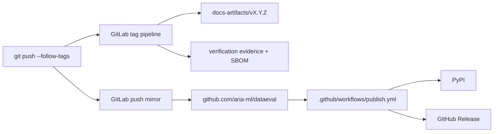
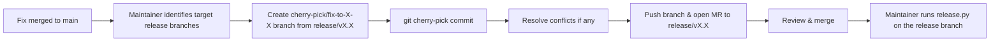
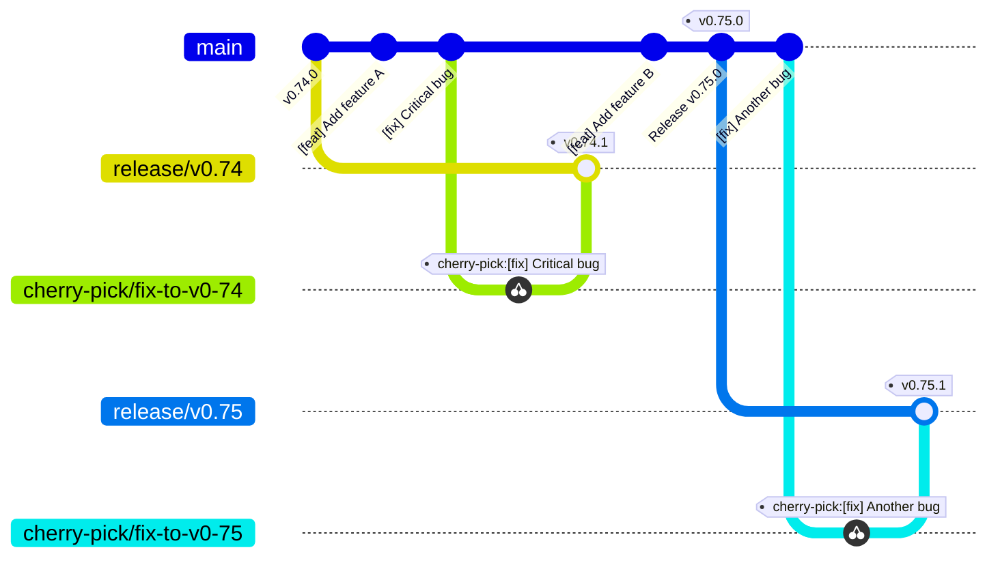
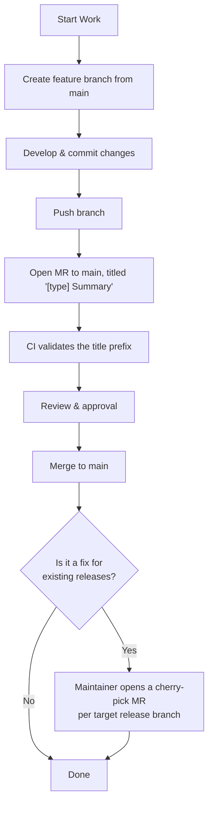
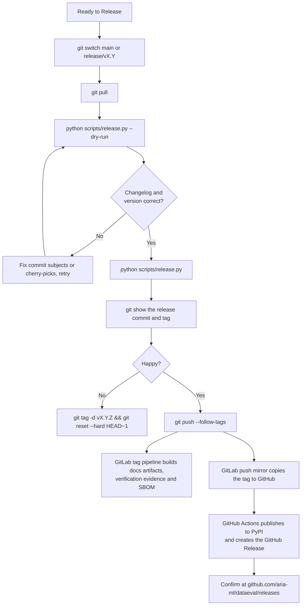

# DataEval Branching and Release Strategy

DataEval follows **GitLab Flow with Release Branches**. Releases are cut from a local checkout with
[`scripts/release.py`](scripts/release.py) and published by pushing the resulting tag.

## Table of Contents

- [Overview](#overview)
- [Branch Structure](#branch-structure)
- [Release Process](#release-process)
- [Commit Prefixes](#commit-prefixes)
- [Workflows](#workflows)
- [Automation](#automation)
- [Version Management](#version-management)

## Overview

Our branching strategy balances the simplicity of trunk-based development with the need to maintain multiple
production release versions. All development flows through the `main` branch, while long-lived `release/vX.X`
branches enable ongoing patch support for deployed versions.

### Key Principles

- **Single source of truth**: All features and fixes merge to `main` first
- **Semantic versioning**: Clear version increments based on change type
- **Manual hotfix propagation**: Maintainers cherry-pick fixes from `main` into release branches via MR
- **Prefix-driven changelog**: The `[type]` prefix on each commit subject determines its changelog section
- **The tag is the release**: Nothing publishes until a maintainer pushes a version tag
- **GitHub does the publishing**: GitLab mirrors the tag to GitHub, whose workflow uploads to PyPI

## Branch Structure

### Primary Branches

| Branch         | Purpose                                                            | Lifetime   | Protected |
| -------------- | ------------------------------------------------------------------ | ---------- | --------- |
| `main`         | Primary development branch, always releasable                      | Permanent  | Yes       |
| `release/vX.X` | Maintenance branch for major.minor version (e.g., `release/v0.74`) | Long-lived | Yes       |

### Temporary Branches

| Branch Pattern             | Purpose                            | Lifetime    | Creator    |
| -------------------------- | ---------------------------------- | ----------- | ---------- |
| `feature/*`, `fix/*`, etc. | Feature/fix development branches   | Short-lived | Developers |
| `cherry-pick/fix-to-X-X`   | Manual hotfix cherry-pick branches | Short-lived | Maintainer |

### Branch Naming Conventions

While not strictly enforced, we recommend the following patterns for clarity:

- **Features**: `feature/<description>` or `<username>/<description>`
- **Bug fixes**: `fix/<issue-number>-<description>` or `<username>/<description>`
- **Documentation**: `docs/<description>`
- **Chores**: `chore/<description>`

## Release Process

Every release -- major, minor, patch or prerelease -- is cut the same way: run the script from the branch you want
to release, review what it produced, then push. The branch you are on decides the bump.

```bash
git switch main && git pull          # or: git switch release/v1.1 && git pull
python scripts/release.py --dry-run  # see the version and changelog first
python scripts/release.py            # update CHANGELOG.md, commit, tag
git show v1.2.0                      # review
git push --follow-tags origin main   # publish
```

The script never pushes. Until you push the tag, nothing has been released and `git tag -d <version> && git reset
--hard HEAD~1` backs the whole thing out.

### Where publishing actually happens

The package is **not** published from GitLab. The tag takes two independent paths:


```mermaid
graph LR
    A[git push --follow-tags] --> B[GitLab tag pipeline]
    B --> C[docs-artifacts/vX.Y.Z]
    B --> D[verification evidence + SBOM]
    A --> E[GitLab push mirror]
    E --> F[github.com/aria-ml/dataeval]
    F --> G[".github/workflows/publish.yml"]
    G --> H[PyPI]
    G --> I[GitHub Release]
```

The mirror is a GitLab *push mirror*, so the hop is asynchronous -- the GitHub workflow starts once the tag
arrives there, not when you push to GitLab.

> **The mirror's status is not a release signal.** Roughly ten historical tags (`v0.94.0` through `v1.0.6` and the
> `v1.0.0-rc*` / `v1.1.0-rc*` series) exist on GitLab but not on GitHub, and GitHub's ruleset refuses to create
> them. The mirror retries them on every run and reports the whole push as failed, so GitLab shows a red mirror and
> an empty "last successful update" permanently. New tags still go across -- a push is not atomic, so the refs that
> pass the ruleset are created while the rejected ones are reported. Confirm a release at
> [github.com/aria-ml/dataeval/releases](https://github.com/aria-ml/dataeval/releases), never from the mirror status.

### What the script does

1. Refuses to run on a dirty tree, on a branch other than `main` or `release/vX.Y`, or on a branch behind its upstream
2. Finds the newest version tag reachable from `HEAD` (for a release branch, the newest in that `vX.Y` series)
3. Reads the first-parent commits since that tag and groups them by their `[type]` prefix
4. Computes the next version, refusing to reuse a tag that already exists
5. Rewrites `CHANGELOG.md` and the Colab links in the docs indexes, commits, and creates an annotated tag

### Release Types

| Command                             | Run from       | Result                              |
| ----------------------------------- | -------------- | ----------------------------------- |
| `python scripts/release.py`          | `main`         | Minor bump (`v1.1.0` -> `v1.2.0`)   |
| `python scripts/release.py major`    | `main`         | Major bump (`v1.1.0` -> `v2.0.0`)   |
| `python scripts/release.py`          | `release/vX.Y` | Patch bump (`v1.1.1` -> `v1.1.2`)   |
| `python scripts/release.py prerelease`   | `main`     | Release candidate (`v1.2.0-rc0`)    |
| `python scripts/release.py prerelease a` | `main`     | Alpha snapshot (`v1.2.0-a0`)        |

A `[major]` commit is not bumped silently: an unqualified release refuses to run and tells you to confirm with
`release.py major`. A prerelease inherits the pending bump, so candidates for a breaking release are numbered
`v2.0.0-rcN` rather than `v1.2.0-rcN`.

Prereleases order as `1.2.0a0 < 1.2.0rc0 < 1.2.0`. Repeated `prerelease a` runs bump `-a0` -> `-a1`; a later
`prerelease` run promotes to `-rc0` on the same base version. Going back down the ladder is refused, since it would
publish a version that sorts before one already on PyPI.

### Patch Releases

Release branches carry fixes and housekeeping only. The script refuses to cut a patch when a `[feat]`, `[major]` or
`[depr]` commit is present -- those belong on `main`.

A `release/vX.Y` branch must already have a `vX.Y.*` tag reachable from it; the branch is cut from its release tag,
so this holds unless the branch was created by hand from the wrong commit.

### Hotfix Cherry-Pick (from `main` to releases)

**Purpose**: Distribute critical fixes to active release branches.

**Trigger**: Manual. After a `[fix]` MR merges to `main`, a maintainer decides which release branches need the fix.


```mermaid
graph LR
    A[Fix merged to main] --> B[Maintainer identifies target release branches]
    B --> C[Create cherry-pick/fix-to-X-X branch from release/vX.X]
    C --> D[git cherry-pick commit]
    D --> E[Resolve conflicts if any]
    E --> F[Push branch & open MR to release/vX.X]
    F --> G[Review & merge]
    G --> H[Maintainer runs release.py on the release branch]
```

**Example commands**:

```bash
git fetch origin
git checkout -b cherry-pick/fix-to-v0-74 origin/release/v0.74
git cherry-pick <commit-sha>
# resolve conflicts if needed, then:
git push -u origin cherry-pick/fix-to-v0-74
# open MR targeting release/v0.74, titled "[fix] ..."
```

### Cutting a Release Branch

**Purpose**: Open a `release/vX.Y` line so a release can receive backported fixes independently of `main`.

Not every release needs a branch. Create one by branching `release/vX.Y` from the `vX.Y.0` tag, in GitLab or locally:

```bash
git switch -c release/v1.2 v1.2.0
git push -u origin release/v1.2
```

## Commit Prefixes

Every merge request to `main` **must** have a `[type]` prefix on its title. CI enforces this with
[`validate_commit_prefix.py`](.gitlab/scripts/validate_commit_prefix.py), because the MR title becomes the commit
subject and the release script reads those subjects to build the changelog. An unrecognized prefix is rejected
rather than being filed under Miscellaneous, which is how a typo like `[imrp]` used to slip through.

Direct commits to `main` follow the same convention.

### Available Prefixes

| Prefix                | Version Bump  | Use Case                             | Changelog Section           |
| --------------------- | ------------- | ------------------------------------ | --------------------------- |
| `[major]`             | MAJOR (X.0.0) | Breaking changes, major API overhaul | Major Release               |
| `[feat]`              | MINOR (0.X.0) | New features, new capabilities       | Feature Release             |
| `[depr]`              | MINOR (0.X.0) | Deprecating or removing functionality| Deprecations and Removals   |
| `[impr]`, `[perf]`    | MINOR (0.X.0) | Enhancements, optimizations          | Improvements and Enhancements |
| `[fix]`               | PATCH (0.0.X) | Bug fixes                            | Fixes                       |
| `[docs]`, `[test]`, `[deps]`, `[type]`, `[devops]`, `[devsecops]`, `[lint]`, `[misc]` | None | Documentation, CI, refactoring, dependencies | Miscellaneous |

The full accepted vocabulary lives in `TAG_CATEGORIES` in [`scripts/release.py`](scripts/release.py); the CI check
imports it, so the two cannot drift.

### Prefix Selection Guide

**Choose `[fix]` when**:

- Fixing a bug that affects existing releases
- Correcting incorrect behavior
- Patching security vulnerabilities
- The fix is a candidate for manual cherry-pick into active release branches

**Choose `[feat]` when**:

- Adding new functionality
- Introducing new APIs or modules
- Adding new configuration options

**Choose `[impr]` when**:

- Enhancing existing features
- Optimizing performance
- Improving error messages or logging

**Choose a housekeeping prefix when**:

- Updating documentation only
- Changing CI/CD configuration
- Internal refactoring with no behavior change
- Updating dependencies without feature changes

## Workflows

### Complete Release Flow Diagram


```mermaid
gitGraph
    commit id: "v0.74.0"
    branch "release/v0.74"
    checkout main
    commit id: "[feat] Add feature A"
    commit id: "[fix] Critical bug"
    branch "cherry-pick/fix-to-v0-74"
    checkout "cherry-pick/fix-to-v0-74"
    cherry-pick id: "[fix] Critical bug"
    checkout "release/v0.74"
    merge "cherry-pick/fix-to-v0-74" tag: "v0.74.1"
    checkout main
    commit id: "[feat] Add feature B"
    commit id: "Release v0.75.0" tag: "v0.75.0"
    branch "release/v0.75"
    checkout main
    commit id: "[fix] Another bug"
    branch "cherry-pick/fix-to-v0-75"
    checkout "cherry-pick/fix-to-v0-75"
    cherry-pick id: "[fix] Another bug"
    checkout "release/v0.75"
    merge "cherry-pick/fix-to-v0-75" tag: "v0.75.1"
```

### Developer Workflow


```mermaid
flowchart TD
    A[Start Work] --> B[Create feature branch from main]
    B --> C[Develop & commit changes]
    C --> D[Push branch]
    D --> E["Open MR to main, titled '[type] Summary'"]
    E --> F[CI validates the title prefix]
    F --> G[Review & approval]
    G --> H[Merge to main]
    H --> I{Is it a fix for<br/>existing releases?}
    I -->|Yes| J[Maintainer opens a cherry-pick MR<br/>per target release branch]
    I -->|No| K[Done]
    J --> K
```

### Maintainer Workflow: Creating a Release


```mermaid
flowchart TD
    A[Ready to Release] --> B[git switch main or release/vX.Y]
    B --> C[git pull]
    C --> D[python scripts/release.py --dry-run]
    D --> E{Changelog and<br/>version correct?}
    E -->|No| F[Fix commit subjects or cherry-picks, retry]
    F --> D
    E -->|Yes| G[python scripts/release.py]
    G --> H[git show the release commit and tag]
    H --> I{Happy?}
    I -->|No| J["git tag -d vX.Y.Z && git reset --hard HEAD~1"]
    I -->|Yes| K[git push --follow-tags]
    K --> L[GitLab tag pipeline builds docs artifacts,<br/>verification evidence and SBOM]
    K --> M[GitLab push mirror copies the tag to GitHub]
    M --> N[GitHub Actions publishes to PyPI<br/>and creates the GitHub Release]
    N --> O[Confirm at github.com/aria-ml/dataeval/releases]
```

## Automation

### What CI does

CI validates and publishes; it does not decide when to release.

| Job                             | Trigger                   | Purpose                                            |
| ------------------------------- | ------------------------- | -------------------------------------------------- |
| `validate commit prefix`        | MRs to main               | Rejects titles without a known `[type]` prefix      |
| `docs`                          | Main, MRs, version tags   | Builds docs; on a tag, publishes `docs-artifacts/<tag>` |
| `publish verification`          | Version tags              | Pushes test evidence and VCRM to the meta repo     |
| `export-merged-sbom`            | Version tags              | Exports the merged SBOM                            |
| `remove docs artifact branches` | Main commits              | Cleans up artifact branches for merged MRs         |
| `tag release candidate`         | Main commits              | Moves the `latest-known-good` marker               |

The release commit itself is skipped by the workflow rules -- it only rewrites `CHANGELOG.md` and the docs index
links, and the tag pushed alongside it already runs everything a release needs.

### Scripts

| Script                                                                   | Purpose                            | Run by      |
| ------------------------------------------------------------------------ | ---------------------------------- | ----------- |
| [`scripts/release.py`](scripts/release.py)                               | Cut a release: changelog, commit, tag | Maintainer, locally |
| [`scripts/test_release.py`](scripts/test_release.py)                     | Self-check for the release logic   | Anyone      |
| [`validate_commit_prefix.py`](.gitlab/scripts/validate_commit_prefix.py) | Enforce MR title prefixes          | CI          |
| [`push_verification.py`](.gitlab/scripts/push_verification.py)           | Publish verification artifacts     | CI          |

### Commit Message Triggers

| Marker           | Effect                                                                   |
| ---------------- | ------------------------------------------------------------------------ |
| `+skipdocsclean` | Build docs from the cached notebook outputs instead of re-executing them |

Commits to `main` normally run the docs build with `nox -e docs -- clean`, which wipes the Jupyter cache and
re-executes every notebook. Adding `+skipdocsclean` to the commit message drops the `clean`, so the build pulls
`.jupyter_cache` from the `docs-artifacts/main` branch and only re-executes notebooks whose code cells
changed. The docs still build and publish -- only the notebook execution is avoided.

Use it for commits that cannot change notebook output (CI config, packaging, prose-only doc edits). The
marker has to appear in the *merge commit* message, which GitLab composes from the MR title and description,
so putting `+skipdocsclean` in either one works. Scheduled pipelines ignore the marker, so the nightly cache
refresh still rebuilds from scratch.

### What Requires Manual Action

- Deciding when to release, and running `scripts/release.py`
- Reviewing the release commit before pushing the tag
- Creating cherry-pick branches and MRs to backport fixes into release branches
- Cutting a `release/vX.Y` branch when a release line needs to receive backports
- Approving MRs to main

## Version Management

### Semantic Versioning

We follow [Semantic Versioning 2.0.0](https://semver.org/):

```text
vMAJOR.MINOR.PATCH
```

- **MAJOR**: Incompatible API changes (`[major]`)
- **MINOR**: New features, backward compatible (`[feat]`, `[impr]`, `[depr]`)
- **PATCH**: Backward compatible bug fixes (`[fix]`)

### Version Calculation Logic

A release from `main` is a minor bump unless a `[major]` commit is pending or `major` is passed explicitly. A release
from `release/vX.Y` is always a patch bump. Housekeeping commits are recorded in the changelog but never drive the
bump on their own.

**Examples**:

- Current `v0.74.5` on main, changes: 3x `[feat]`, 2x `[fix]` -> next `v0.75.0`
- Current `v0.74.5` on main, changes include 1x `[major]` -> `release.py` requires `release.py major` -> next `v1.0.0`
- Current `v0.74.5` on `release/v0.74`, changes: 1x `[fix]` -> next `v0.74.6`

### Version Tag Format

- All version tags start with `v` prefix (e.g., `v0.74.0`, `v1.0.0`)
- Tags are annotated git tags
- Tags are immutable once published
- Pushing a tag triggers everything: the GitLab tag pipeline (docs artifacts, verification, SBOM) and, via the
  push mirror, the GitHub workflow that uploads to PyPI and creates the GitHub Release

### Release Branch Lifecycle

**Creation**: Release branches are cut on demand by a maintainer -- see
[Cutting a Release Branch](#cutting-a-release-branch)

**Naming**: `release/vX.Y` (major.minor only, no patch number)

**Maintenance**: Release branches receive cherry-picked fixes from `main`

**End-of-Life** (EOL):

- Release branches may be maintained indefinitely or archived when no longer supported
- EOL policy should be defined based on product requirements
- Consider maintaining N-2 releases (e.g., if current is v0.75, support v0.74 and v0.73)

**Archiving**: When a release reaches EOL:

```bash
git branch -m release/v0.70 archived/release/v0.70
git push origin archived/release/v0.70
git push origin --delete release/v0.70
```

## Best Practices

### For Developers

1. **Title every MR `[type] Summary`** -- the title becomes the commit subject and the changelog entry
2. **Flag fixes that may need backport** - `[fix]` MRs are candidates for manual cherry-pick into releases
3. **Keep changes focused** - One MR should have one primary purpose
4. **Write clear MR titles** - They are what users read in the changelog
5. **Test thoroughly** - Fixes cherry-picked to release branches land in production patch releases

### For Maintainers

1. **Always `--dry-run` first** - It costs nothing and shows the exact changelog and version
2. **Review before pushing** - The tag is the point of no return; the commit before it is free to discard
3. **Pull before releasing** - The script refuses to run on a stale branch, but start fresh anyway
4. **Cherry-pick fixes promptly** - When a `[fix]` lands on `main`, decide quickly whether it needs backport
5. **Define EOL policy** - Decide which release branches to actively maintain

### For the Team

1. **Document breaking changes** - Use MR descriptions to explain impact
2. **Coordinate deprecations** - Give users advance notice
3. **Test on release branches** - Don't just test on `main`
4. **Keep this document updated** - Process improvements should be reflected here

## Comparison to Other Strategies

Our strategy is based on **GitLab Flow (Release Branches)** with enhancements:

| Feature                     | Our Strategy          | GitLab Flow | Git Flow       | GitHub Flow |
| --------------------------- | --------------------- | ----------- | -------------- | ----------- |
| Main development branch     | `main`                | ✓           | `develop`      | `main`      |
| Long-lived release branches | `release/vX.X`        | ✓           | `release/vX.X` | ✗           |
| Cherry-pick into releases   | Manual                | Manual      | ✗              | ✗           |
| Prefix-driven changelog     | ✓                     | ✗           | ✗              | ✗           |
| Hotfix branches             | Manual cherry-pick MR | Manual      | `hotfix/`      | ✗           |
| CI/CD integrated            | ✓                     | ✓           | Optional       | ✓           |

**What makes our strategy unique**:

- Prefix-driven semantic versioning, validated at merge time
- Full changelog automation from commit subjects, with no credentials required to generate it
- A human review step between generating a release and publishing it

## Troubleshooting

### Common Issues

**Issue**: MR blocked because the title has no `[type]` prefix, or an unknown one

- **Solution**: Retitle the MR. The error message lists every valid prefix.

**Issue**: `release.py` says the working tree is not clean

- **Solution**: Commit or stash your changes. The release commit must contain only what the script generates.

**Issue**: `release.py` says the branch is behind its upstream

- **Solution**: `git pull`. Releasing from a stale branch computes a version that may already be published.

**Issue**: `release.py` says the tag already exists

- **Solution**: Someone has already released that version. Fetch and check what is on the remote before retrying.

**Issue**: `release.py` refuses because a `[major]` change is pending

- **Solution**: Run `python scripts/release.py major` to confirm the breaking bump, or move the change off the branch.

**Issue**: A patch release is refused because of a `[feat]` commit on the release branch

- **Solution**: Features belong on `main`. Revert it from the release branch and release it from `main` instead.

**Issue**: The changelog entry for a merge commit reads "Merge branch ..."

- **Solution**: The MR title was empty or the merge was made by hand. Amend the commit subject before releasing.

**Issue**: The tag is on GitLab but no GitHub Release or PyPI upload appeared

- **Solution**: Check [the GitHub releases page](https://github.com/aria-ml/dataeval/releases) and the Actions tab
  there. The GitLab mirror status is permanently red because of an unpushable backlog of historical tags, so it
  cannot tell you whether this tag made it. If the tag is genuinely missing on GitHub, push it there directly.

**Issue**: A release was tagged but should not have been

- **Solution**: If it has not been pushed, `git tag -d <version> && git reset --hard HEAD~1`. Once pushed, the tag is
  published -- cut a new version rather than deleting it.

**Issue**: Cherry-pick has conflicts

- **Solution**: Resolve conflicts locally on the `cherry-pick/fix-to-X-X` branch before pushing, or skip the cherry-pick
  and open a new fix MR directly against the release branch

**Issue**: Fix on `main` didn't reach a release branch

- **Solution**: Cherry-picks are manual. Open a cherry-pick MR targeting `release/vX.X` yourself — nothing will do it
  automatically.

## References

- [GitLab Flow Documentation](https://about.gitlab.com/topics/version-control/what-is-gitlab-flow/)
- [Semantic Versioning 2.0.0](https://semver.org/)
- [Git Branching Model Comparison](https://www.gitkraken.com/learn/git/best-practices/git-branch-strategy)
- Project CI/CD Configuration: [`.gitlab-ci.yml`](.gitlab-ci.yml)
- Release script: [`scripts/release.py`](scripts/release.py)

## Questions or Feedback

If you have questions about the branching strategy or suggestions for improvements:

- Open an issue in the project repository
- Discuss in team meetings
- Propose changes via MR to this document
