# DataEval Branching and Release Strategy

DataEval follows **GitLab Flow with Release Branches**, enhanced with automated cherry-picking and label-driven
semantic versioning.

## Table of Contents

- [Overview](#overview)
- [Branch Structure](#branch-structure)
- [Release Process](#release-process)
- [Release Labels](#release-labels)
- [Workflows](#workflows)
- [Automation](#automation)
- [Version Management](#version-management)

## Overview

Our branching strategy balances the simplicity of trunk-based development with the need to maintain multiple
production release versions. All development flows through the `main` branch, while long-lived `release/vX.X`
branches enable ongoing patch support for deployed versions.

### Key Principles

- **Single source of truth**: All features and fixes merge to `main` first
- **Semantic versioning**: Clear version increments based on change type
- **Automated maintenance**: Hotfixes automatically propagate to release branches
- **Label-driven releases**: MR labels determine release type and changelog categorization

## Branch Structure

### Primary Branches

| Branch         | Purpose                                                            | Lifetime   | Protected |
| -------------- | ------------------------------------------------------------------ | ---------- | --------- |
| `main`         | Primary development branch, always releasable                      | Permanent  | Yes       |
| `release/vX.X` | Maintenance branch for major.minor version (e.g., `release/v0.74`) | Long-lived | Yes       |

### Temporary Branches

| Branch Pattern             | Purpose                               | Lifetime    | Creator       |
| -------------------------- | ------------------------------------- | ----------- | ------------- |
| `feature/*`, `fix/*`, etc. | Feature/fix development branches      | Short-lived | Developers    |
| `cherry-pick/fix-to-X-X`   | Automated hotfix cherry-pick branches | Short-lived | CI automation |

### Branch Naming Conventions

While not strictly enforced, we recommend the following patterns for clarity:

- **Features**: `feature/<description>` or `<username>/<description>`
- **Bug fixes**: `fix/<issue-number>-<description>` or `<username>/<description>`
- **Documentation**: `docs/<description>`
- **Chores**: `chore/<description>`

## Release Process

### Release Types

We support three types of releases, each with different triggers and processes:

#### 1. Major/Minor Releases (from `main`)

**Purpose**: New features, improvements, deprecations, or breaking changes

**Trigger**: Manual pipeline execution with `CREATE_NEW_RELEASE=true` variable

**Process**:


**Script**: [`.gitlab/scripts/create_release.py`](.gitlab/scripts/create_release.py)

**Version Increment**:

- `release::major` → MAJOR version bump (e.g., v0.74.0 → v1.0.0)
- `release::feature` → MINOR version bump (e.g., v0.74.0 → v0.75.0)
- `release::improvement` → MINOR version bump
- `release::deprecation` → MINOR version bump

#### 2. Patch Releases (from `release/vX.X`)

**Purpose**: Bug fixes to existing releases

**Trigger**: Automatic on any commit to `release/v*` branches

**Process**:


**Script**: [`.gitlab/scripts/create_patch_release.py`](.gitlab/scripts/create_patch_release.py)

**Version Increment**: Patch version only (e.g., v0.74.2 → v0.74.3)

**Constraints**:

- Only `release::fix` labeled MRs allowed on release branches
- No features or breaking changes permitted

#### 3. Hotfix Cherry-Pick (from `main` to releases)

**Purpose**: Automatically distribute critical fixes to all active release branches

**Trigger**: Automatic when commit with `release::fix` label merges to `main`

**Process**:


**Script**: [`.gitlab/scripts/cherry_pick_fixes_to_releases.py`](.gitlab/scripts/cherry_pick_fixes_to_releases.py)

**Manual Step**: Maintainers must review and merge the auto-generated cherry-pick MRs

## Release Labels

Every merge request to `main` **must** have exactly one `release::*` label. This requirement is enforced by CI validation.

### Available Labels

| Label                  | Version Bump  | Use Case                             | Changelog Section |
| ---------------------- | ------------- | ------------------------------------ | ----------------- |
| `release::major`       | MAJOR (X.0.0) | Breaking changes, major API overhaul | Breaking Changes  |
| `release::feature`     | MINOR (0.X.0) | New features, new capabilities       | Features          |
| `release::improvement` | MINOR (0.X.0) | Enhancements to existing features    | Improvements      |
| `release::deprecation` | MINOR (0.X.0) | Deprecating functionality            | Deprecations      |
| `release::fix`         | PATCH (0.0.X) | Bug fixes (triggers cherry-picks)    | Bug Fixes         |
| `release::misc`        | None          | Documentation, CI, refactoring       | Miscellaneous     |

### Label Selection Guide

**Choose `release::fix` when**:

- Fixing a bug that affects existing releases
- Correcting incorrect behavior
- Patching security vulnerabilities
- The fix should propagate to all active release branches

**Choose `release::feature` when**:

- Adding new functionality
- Introducing new APIs or modules
- Adding new configuration options

**Choose `release::improvement` when**:

- Enhancing existing features
- Optimizing performance
- Improving error messages or logging

**Choose `release::misc` when**:

- Updating documentation only
- Changing CI/CD configuration
- Internal refactoring with no behavior change
- Updating dependencies without feature changes

## Workflows

### Complete Release Flow Diagram


### Developer Workflow


### Maintainer Workflow: Creating a Release

```mermaid
flowchart TD
    A[Ready to Release] --> B{Release Type?}
    B -->|Major/Minor| C[Go to GitLab CI/CD Pipeline]
    B -->|Patch| D[Merge fix MR to release branch]
    C --> E["Expand '🚀 Build' flyout"]
    E --> F[Click 'Pipeline schedules']
    F --> G[Run 'Manual release' pipeline]
    G --> H[Script scans merged MRs]
    H --> I[Calculates version from labels]
    I --> J[Generates changelog]
    J --> K[Creates git tag vX.Y.0]
    K --> L[Creates release/vX.Y branch]
    L --> M[Publishes release]
    M --> N[Done]
    D --> O[CI detects commit on release branch]
    O --> P[Validates only release::fix MRs]
    P --> Q[Increments patch version]
    Q --> R[Creates git tag vX.Y.Z]
    R --> S[Publishes patch release]
    S --> N
```



## Automation

Our release process is highly automated through GitLab CI/CD pipelines.

### Automated Scripts

All automation scripts are located in [`.gitlab/scripts/`](.gitlab/scripts/):

| Script                                                                                 | Purpose                        | Trigger                            |
| -------------------------------------------------------------------------------------- | ------------------------------ | ---------------------------------- |
| [`create_release.py`](.gitlab/scripts/create_release.py)                               | Create major/minor releases    | Manual: `CREATE_NEW_RELEASE=true`  |
| [`create_patch_release.py`](.gitlab/scripts/create_patch_release.py)                   | Create patch releases          | Auto: Commit to `release/v*`       |
| [`cherry_pick_fixes_to_releases.py`](.gitlab/scripts/cherry_pick_fixes_to_releases.py) | Cherry-pick fixes to releases  | Auto: `release::fix` merge to main |
| [`validate_release_label.py`](.gitlab/scripts/validate_release_label.py)               | Ensure MRs have release labels | Auto: All MRs to main              |
| [`releasegen.py`](.gitlab/scripts/releasegen.py)                                       | Core release logic & changelog | Called by release scripts          |
| [`versiontag.py`](.gitlab/scripts/versiontag.py)                                       | Version parsing & increment    | Called by release scripts          |

### CI/CD Pipeline

The release pipeline consists of these key jobs:


### What Gets Automated

**Fully Automated** (no human intervention):

- Release label validation on MRs
- Version number calculation
- Changelog generation from MR labels
- Git tag creation
- Release branch creation
- Cherry-pick branch creation and MR generation
- Patch release creation when fixes are merged

**Requires Manual Action**:

- Triggering major/minor releases (set `CREATE_NEW_RELEASE=true`)
- Reviewing and merging cherry-pick MRs to release branches
- Approving MRs to main

## Version Management

### Semantic Versioning

We follow [Semantic Versioning 2.0.0](https://semver.org/):

```text
vMAJOR.MINOR.PATCH
```

- **MAJOR**: Incompatible API changes (`release::major`)
- **MINOR**: New features, backward compatible (`release::feature`, `release::improvement`, `release::deprecation`)
- **PATCH**: Backward compatible bug fixes (`release::fix`)

### Version Calculation Logic

The version bump is determined by the **highest priority** label among all MRs since the last release:

**Priority Order** (highest to lowest):

1. `release::major` → Bump MAJOR version
2. `release::feature`, `release::improvement`, `release::deprecation` → Bump MINOR version
3. `release::fix` → Bump PATCH version (for major/minor releases from main)
4. `release::misc` → No version bump (must have other changes)

**Examples**:

- Current: `v0.74.5`, Changes: 3× `release::feature`, 2× `release::fix` → Next: `v0.75.0`
- Current: `v0.74.5`, Changes: 1× `release::major`, 5× `release::feature` → Next: `v1.0.0`
- Current: `v0.74.5`, Changes on `release/v0.74`: 1× `release::fix` → Next: `v0.74.6`

### Version Tag Format

- All version tags start with `v` prefix (e.g., `v0.74.0`, `v1.0.0`)
- Tags are annotated git tags with release notes
- Tags are immutable once published
- Tags trigger additional CI/CD processes (Docker image builds, documentation publishing)

### Release Branch Lifecycle

**Creation**: Release branches are created automatically when a major/minor release is published from `main`

**Naming**: `release/vX.Y` (major.minor only, no patch number)

**Maintenance**: Release branches receive cherry-picked fixes from `main`

**End-of-Life** (EOL):

- Release branches may be maintained indefinitely or archived when no longer supported
- EOL policy should be defined based on product requirements
- Consider maintaining N-2 releases (e.g., if current is v0.75, support v0.74 and v0.73)

**Archiving**: When a release reaches EOL:

```bash
git branch -m release/v0.70 archived/release/v0.70
git push origin archived/release/v0.70
git push origin --delete release/v0.70
```

## Best Practices

### For Developers

1. **Always add a `release::*` label** to your MR before requesting review
2. **Choose `release::fix` carefully** - it triggers automatic cherry-picks to all release branches
3. **Keep changes focused** - One MR should have one primary purpose
4. **Write clear MR descriptions** - They become part of the changelog
5. **Test thoroughly** - Fixes with `release::fix` will propagate to production releases

### For Maintainers

1. **Review cherry-pick MRs promptly** - They may contain critical fixes
2. **Monitor release branch health** - Ensure patches are being applied successfully
3. **Coordinate major/minor releases** - Communicate with team before triggering
4. **Verify changelog accuracy** - Auto-generated but should be reviewed
5. **Define EOL policy** - Decide which release branches to actively maintain

### For the Team

1. **Document breaking changes** - Use MR descriptions to explain impact
2. **Coordinate deprecations** - Give users advance notice
3. **Test on release branches** - Don't just test on `main`
4. **Monitor automation** - Check CI/CD pipeline results
5. **Keep this document updated** - Process improvements should be reflected here

## Comparison to Other Strategies

Our strategy is based on **GitLab Flow (Release Branches)** with enhancements:

| Feature                     | Our Strategy    | GitLab Flow | Git Flow       | GitHub Flow |
| --------------------------- | --------------- | ----------- | -------------- | ----------- |
| Main development branch     | `main`          | ✓           | `develop`      | `main`      |
| Long-lived release branches | `release/vX.X`  | ✓           | `release/vX.X` | ✗           |
| Automated cherry-picks      | ✓               | ✗           | ✗              | ✗           |
| Label-driven versioning     | ✓               | ✗           | ✗              | ✗           |
| Hotfix branches             | ✗ (cherry-pick) | Manual      | `hotfix/`      | ✗           |
| CI/CD integrated            | ✓               | ✓           | Optional       | ✓           |

**What makes our strategy unique**:

- Automated hotfix distribution to all active releases
- Label-driven semantic versioning
- Validation enforced at merge time
- Full changelog automation

## Troubleshooting

### Common Issues

**Issue**: MR blocked because missing `release::*` label

- **Solution**: Add the appropriate label based on the change type

**Issue**: Cherry-pick MR has conflicts

- **Solution**: Manually resolve conflicts in the cherry-pick branch, or create a new fix MR directly on the release branch

**Issue**: Wrong version number generated

- **Solution**: Check that MRs have correct labels; re-run release with corrections if needed

**Issue**: Release branch not receiving cherry-picks

- **Solution**: Verify the branch follows `release/vX.X` naming pattern and exists in the repository

**Issue**: Patch release fails validation

- **Solution**: Ensure only `release::fix` labeled MRs are merged to release branches; other change types must go to
  `main` first

## References

- [GitLab Flow Documentation](https://about.gitlab.com/topics/version-control/what-is-gitlab-flow/)
- [Semantic Versioning 2.0.0](https://semver.org/)
- [Git Branching Model Comparison](https://www.gitkraken.com/learn/git/best-practices/git-branch-strategy)
- Project CI/CD Configuration: [`.gitlab-ci.yml`](.gitlab-ci.yml)
- Release Scripts: [`.gitlab/scripts/`](.gitlab/scripts/)

## Questions or Feedback

If you have questions about the branching strategy or suggestions for improvements:

- Open an issue in the project repository
- Discuss in team meetings
- Propose changes via MR to this document
