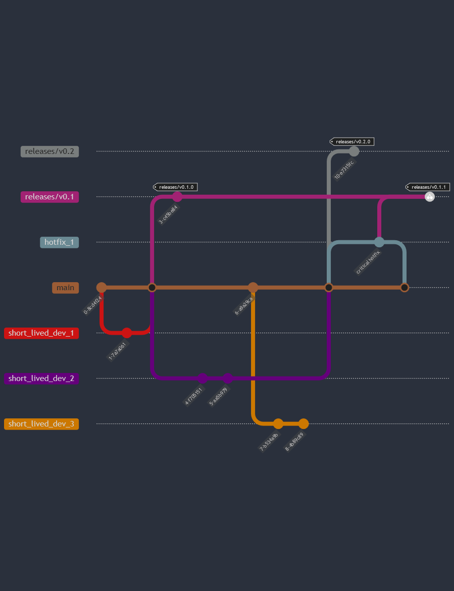

# Data Assessment Metrics Library (DAML)

## Overview
Below you will find detailed instructions on the pre-requisites and steps to set up and contribute to the DAML project.  This assumes you have an active developer account with [JATIC GitLab](https://gitlab.jatic.net/).

## Environment
Currently only Linux and Linux on Windows (via Windows Subsystem for Linux 2 - WSL2) are supported.  We use Ubuntu (both natively and in Windows) but other distributions should work as well.  Ubuntu 20.04 and 22.04 have been tested on natively, as well as on WSL2 in Windows 10 and 11.

### Dependencies
- [git-lfs](https://git-lfs.com/) - Large file storage for binaries in git repository
- [graphviz](https://graphviz.org/) - Documentation dependency for rendering diagrams in documentation
- [Visual Studio Code](https://code.visualstudio.com/Download) - Development IDE
- [Docker Desktop](https://www.docker.com/products/docker-desktop/) (Optional) - Containerization software for developer environment management
- [Remote Development Extension Pack](https://marketplace.visualstudio.com/items?itemName=ms-vscode-remote.vscode-remote-extensionpack) (Optional) - Visual Studio Code extension pack enabling development in containers and in WSL2

## Getting Started

### Installing WSL2 (Windows Only)
Follow the steps detailed at [learn.microsoft.com](https://learn.microsoft.com/en-us/windows/wsl/install) to get WSL2 installed.  Ubuntu 20.04 or 22.04 is recommended.

### Identity and Security
#### SSH Key
The SSH key is your user credentials for GitLab, giving you permissions to access the repository. Additional information on configuring the SSH key can be found [here](https://gitlab.jatic.net/help/user/ssh.md).

##### Generate and set the SSH key
- `ssh-keygen -t ed25519 -C "user@domain.com"`
- Upload the SSH key (defaults to ~/.ssh/id_ed25519.pub) to your [GitLab profile](https://gitlab.jatic.net/-/profile/keys)

#### GPG Key
The GPG key is used to sign your commits to ensure the identity of the origin of the commit. GitLab provides documentation for the GPG signing process [here](https://docs.gitlab.com/ee/user/project/repository/signed_commits/gpg.html).

##### Generate an RSA+RSA 4096 bit GPG key
   1. `gpg --full-gen-key`
   2. Select RSA and RSA and use 4096-bit key length
   3. Select a validity period
   4. Enter name and email address **matching** your GitLab account
   5. Enter optional comment which displays in parentheses after your name (e.g. `John Doe (Comment)`)
   6. Confirm your entries
   7. Set a strong password - this will be required on every commit

##### Note down the `<KEY ID>`
- `gpg --list-secret-keys --keyid-format LONG`
- The key begins after the encryption method (eg: `sec   rsa4096/<KEY ID>`)

##### Export the public key to upload to GitLab
- `gpg --armor --export <KEY ID>`
- Upload the full key to your [GitLab Profile](https://gitlab.jatic.net/-/profile/gpg_keys)

##### Install Pin Entry Utility (Windows Only)
- `sudo apt-get install pinentry-gtk2`

#### Local settings
##### Install dependencies
You can install [git-lfs](https://git-lfs.com/) from the distribution repository
```
:~$ sudo apt-get install git-lfs
```
(Optional) If you are developing locally, you will need [graphviz](https://graphviz.org/) for generating documentation diagrams
```
:~$ sudo apt-get install graphviz
```

##### Configure git user settings
```
:~$ git config --global user.name "User Name"
:~$ git config --global user.email "username@domain.com"
```

##### Configure git to sign commits
```
:~$ git config --global user.signingkey <KEY ID>
:~$ git config --global commit.gpgsign true
```

### Clone DAML
```
:~$ git clone git@gitlab.jatic.net:jatic/aria/daml.git
:~$ cd daml
```

### Harbor Image Registry (Recommended)
In order to perform build caching and normalize development environments, DAML utilizes images built on top of Ubuntu and Nvidia CUDA images.  These images are stored in the [Harbor Image Registry](https://harbor.jatic.net/) hosted alongside our [Gitlab](https://gitlab.jatic.net).

To use images stored in the registry, follow these steps:

1. Browse to https://harbor.jatic.net/
2. Sign in via OIDC provider (this will authenticate you through jatic.net)
3. Access your user profile icon in the top right corner
4. Note down your username and copy the CLI secret
5. Log in to the registry through docker CLI
   1. `docker login harbor.jatic.net:443`
   2. Enter username as shown
   3. Paste CLI secret token as password
6. Contact @aweng for access permissions to the daml project.

### Visual Studio Code Development Containers (Recommended)
This option allows you to run or test DAML in a virtual development container fully isolated from the host environment.  It also allows you to run on different versions of Python independently of what is on your host environment.

#### Prerequisites
Ensure that [Visual Studio Code](https://code.visualstudio.com/Download) with the [Remote Development Extension Pack](https://marketplace.visualstudio.com/items?itemName=ms-vscode-remote.vscode-remote-extensionpack) is installed, as well as [Docker Desktop](https://www.docker.com/products/docker-desktop/) (with WSL2 backend if on Windows).

#### Building the development container
Run the `devenv` script to build the images needed to run in a devcontainer.  By default this includes all supported versions of Python and dependencies, so can take quite a bit of time and storage (~50GB).
```
:~/daml$ ./devenv
```
Alternatively you can select a subset of Python versions to be available in the development container.  For instance this will create a devcontainer with just Python 3.8 and 3.11.
```
:~/daml$ ./devenv 3.8 3.11
```

#### Starting the development container

_Note: In VS Code, press_ `F1` _or_ `Ctrl+Shift+P` _to open the_ `Command Palette`

1. Open the DAML project in VS Code
2. Using the `Command Palette`
   1. `>Dev Containers: Rebuild and Reopen in Container`
   2. `>Python: Select Interpreter`

The devcontainer is configured to share the SSH keys on the host environment to allow git commands to work.  If you are unable to pull or commit, check the `.ssh` folder in the `$HOME` or `%USERPROFILE%` path and ensure that it is correctly configured.

### Run Tests

DAML uses containers to normalize environments for testing and development.  The build script automates building docker containers and running tests in parallel.  The run script allows you to run the same commands locally in your devcontainer.

| Function | Container | Local (Devcontainer) |
| -------- | --------- | -------------------- |
| Run unit tests, typecheck and linting GPU | `./build --gpu` | N/A |
| Run unit tests, typecheck and linting | `./build` | N/A |
| Run unit tests on all versions | `./build unit` | N/A |
| Run unit tests and typecheck on python 3.11 | `./build 3.11` | N/A |
| Run only typecheck on python 3.10 | `./build type 3.10` | `pyenv shell 3.10; ./run type` |
| Run only unit tests on python 3.8 | `./build unit 3.8` | `pyenv shell 3.8; ./run unit` |
| Run only unit tests on python 3.9 w/ GPU enabled | `./build unit 3.9 --gpu` | `pyenv shell 3.9; ./run unit 3.9` |
| Build documentation | `./build docs` | `pyenv shell 3.11; ./run docs` |

- Note: The python version argument is optional for `./run`, and it will use the active version of python if not specified.
- Note: The `./run` command executes on your local devcontainer which already has GPU access enabled.
- Note: Adding a convenience parameter to `./run` is coming soon.

## Branching Release Workflow

This section outlines the branching and release strategy used for DAML.

### Branching Strategy

Development is done using a lightweight version of Gitflow.  There are 2 long lived branches, `develop` and `main`.  Development happens against the `develop` branch and changes merged in to `develop` are added to a new or existing merge request in to `main`.

The merge request in to `main` includes additional validation in the form of extensive functional tests.  After feature validation is performed and documentation is reviewed, the merge request is approved and `develop` is merged in to `main`, which triggers release to PyPI and ReadTheDocs.

Hotfixes are merged directly in to `main` and the change is cherry-picked in to `develop`.

### Branching Diagram


### Gitlab CI Pipelines
- `.gitlab-ci.yaml`
- Pipelines will always run as baseline:
  - `build`, `linting`, `lite`, `docs`, `test`->`coverage` (or `functional` superset)
- Feature work should happen in short-lived (as much as possible) branches off of `develop`
- Merge requests from features to `develop` will trigger baseline run
- Completed merge requests in to `develop` will trigger baseline and additionally
  - Run additional jobs: `create_mr`, `pages`->`pages:deploy`
    - `pages`->`pages:deploy`: pushes artifacts from docs to pages html server
    - `create_mr`: creates or updates the merge request from develop->main with features included in the pending release
- Merge requests from `develop` to `main` will trigger baseline with functional tests
  - Run additional jobs: `functional`->`coverage`
- Hotfixes branch from `main` and merged directly back in to `main`
  - The commit for the hotfix will then be cherry-picked in to `develop`
- Completed merge requests in to `main` will trigger baseline and additionally
  - Run additional jobs: `changelog`, `publish`, `tag`
  - `changelog`: updates the changelog in develop with new features and cherry picks change into main
  - `publish`: packages DAML and publishes to JATIC Gitlab internal repository
  - `tag`: adds an annotated tag with version number for the change

### Github Actions
- `.github/workflows/publish.yml`
- This action is configured on new tags to publish to pypi

### ReadTheDocs Pipeline
-----------
- `.readthedocs.yaml`
- The pipeline is configured to build documentation using Sphinx on changes to the Github repository for branches `develop` and `main`: 
