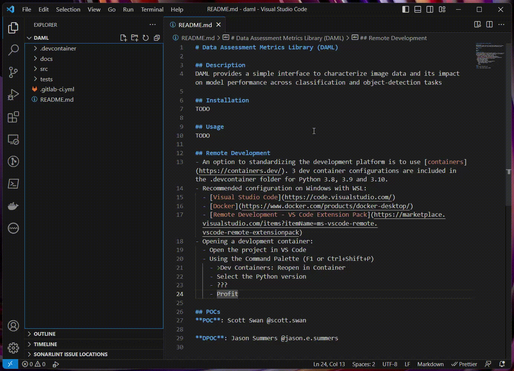

# Data Assessment Metrics Library (DAML)

## Description
DAML provides a simple interface to characterize image data and its impact on model performance across classification and object-detection tasks

## Installation
### Prerequisites
- Must have at least python3.8+ and preferably no greater than python3.10 installed
- git
- pip

### Virtual Environment versus Docker container
#### [Option 1] Setting up a virtual environment
- install the virtualenv model from python pip
```
jgleeson@daml:$ python3 -m pip install virtualenv
```

- create a directory in the project called `env` and activate that directory
```
jgleeson@daml:$ mkdir env
jgleeson@daml:$ python3 -m venv env
jgleeson@daml:$ source env/bin/activate
(env) jgleeson@daml:$ python -m pip install tox
```

- build the package and install to the virtual environment
```
(env) jgleeson@daml:$ python -m build
* Creating venv isolated environment...
* Installing packages in isolated environment... (poetry-core)
* Getting build dependencies for sdist...
* Building sdist...
* Building wheel from sdist
* Creating venv isolated environment...
* Installing packages in isolated environment... (poetry-core)
* Getting build dependencies for wheel...
* Building wheel...
Successfully built daml-0.0.1.tar.gz and daml-0.0.1-py3-none-any.whl
(env) jgleeson@daml:$
(env) jgleeson@daml:$
(env) jgleeson@daml:$
(env) jgleeson@daml:$ python -m pip install --force-reinstall dist/daml-0.0.1-py3-none-any.whl
Processing ./dist/daml-0.0.1-py3-none-any.whl
Installing collected packages: daml
  Attempting uninstall: daml
    Found existing installation: daml 0.0.1
    Uninstalling daml-0.0.1:
      Successfully uninstalled daml-0.0.1
Successfully installed daml-0.0.1
(env) jgleeson@daml:$
```

- run the unit tests using `pytest`
```
(env) jgleeson@daml:$ pytest -v tests/
=================================== test session starts ====================================
platform linux -- Python 3.10.6, pytest-7.4.0, pluggy-1.2.0 -- /home/jgleeson/aria/code/cdao/daml/env/bin/python
cachedir: .pytest_cache
rootdir: /home/jgleeson/aria/code/cdao/daml
collected 1 item

tests/test_helloworld.py::TestHelloWorld::test_hello_world PASSED                    [100%]

==================================== 1 passed in 0.01s =====================================
(env) jgleeson@daml:$
```

- run the code coverage report using `tox`. NOTE: tox will build and re-install the package artifact replacing the above 
```
(env) jgleeson@daml:$ tox -e coverage
.pkg: _optional_hooks> python /home/jgleeson/.local/lib/python3.10/site-packages/pyproject_api/_backend.py True poetry.core.masonry.api
.pkg: get_requires_for_build_sdist> python /home/jgleeson/.local/lib/python3.10/site-packages/pyproject_api/_backend.py True poetry.core.masonry.api
.pkg: prepare_metadata_for_build_wheel> python /home/jgleeson/.local/lib/python3.10/site-packages/pyproject_api/_backend.py True poetry.core.masonry.api
.pkg: build_sdist> python /home/jgleeson/.local/lib/python3.10/site-packages/pyproject_api/_backend.py True poetry.core.masonry.api
coverage: install_package> python -I -m pip install --force-reinstall --no-deps /home/jgleeson/aria/code/cdao/daml/.tox/.tmp/package/29/daml-0.0.1.tar.gz
coverage: commands[0]> coverage erase
coverage: commands[1]> coverage run --branch -m pytest --junitxml=junit.xml -v tests/
=================================== test session starts ====================================
platform linux -- Python 3.10.6, pytest-7.4.0, pluggy-1.2.0 -- /home/jgleeson/aria/code/cdao/daml/.tox/coverage/bin/python
cachedir: .tox/coverage/.pytest_cache
rootdir: /home/jgleeson/aria/code/cdao/daml
collected 1 item

tests/test_helloworld.py::TestHelloWorld::test_hello_world PASSED                    [100%]

------------- generated xml file: /home/jgleeson/aria/code/cdao/daml/junit.xml -------------
==================================== 1 passed in 0.02s =====================================
coverage: commands[2]> coverage report -m --skip-empty
Name                       Stmts   Miss Branch BrPart  Cover   Missing
----------------------------------------------------------------------
tests/test_helloworld.py       7      0      0      0   100%
----------------------------------------------------------------------
TOTAL                          7      0      0      0   100%
coverage: commands[3]> coverage xml
Wrote XML report to coverage.xml
.pkg: _exit> python /home/jgleeson/.local/lib/python3.10/site-packages/pyproject_api/_backend.py True poetry.core.masonry.api
  coverage: OK (2.25=setup[1.78]+cmd[0.07,0.25,0.07,0.07] seconds)
  congratulations :) (2.29 seconds)
(env) jgleeson@daml:$
```

-run the lint test using `tox`
```
(env) jgleeson@daml:$ tox -e lint
.pkg: _optional_hooks> python /home/jgleeson/.local/lib/python3.10/site-packages/pyproject_api/_backend.py True poetry.core.masonry.api
.pkg: get_requires_for_build_sdist> python /home/jgleeson/.local/lib/python3.10/site-packages/pyproject_api/_backend.py True poetry.core.masonry.api
.pkg: prepare_metadata_for_build_wheel> python /home/jgleeson/.local/lib/python3.10/site-packages/pyproject_api/_backend.py True poetry.core.masonry.api
.pkg: build_sdist> python /home/jgleeson/.local/lib/python3.10/site-packages/pyproject_api/_backend.py True poetry.core.masonry.api
lint: install_package> python -I -m pip install --force-reinstall --no-deps /home/jgleeson/aria/code/cdao/daml/.tox/.tmp/package/30/daml-0.0.1.tar.gz
lint: commands[0]> flake8 --count src/
0
lint: commands[1]> black --check --diff src/
All done! ✨ 🍰 ✨
2 files would be left unchanged.
lint: commands[2]> isort --check --diff src/
.pkg: _exit> python /home/jgleeson/.local/lib/python3.10/site-packages/pyproject_api/_backend.py True poetry.core.masonry.api
  lint: OK (2.13=setup[1.78]+cmd[0.11,0.16,0.08] seconds)
  congratulations :) (2.17 seconds)
(env) jgleeson@daml:$
```

#### [Option 2] Pull the Docker container
TODO

### Pulling the Repo from JATIC-GitLab
- upload an SSH key to your profile:
`User -> Edit Profile -> SSH Keys`

- for details on how to do this: https://gitlab.jatic.net/help/user/ssh.md

- Clone the repo from the JATIC GitLab to your local workspace
```
jgleeson@cdao:$ git clone git@gitlab.jatic.net:jatic/aria/daml.git daml
Cloning into 'daml'...
[SNIP]
Enter passphrase for key '/home/jgleeson/.ssh/id_ed25519':
remote: Enumerating objects: 20, done.
remote: Counting objects: 100% (6/6), done.
remote: Compressing objects: 100% (6/6), done.
remote: Total 20 (delta 2), reused 0 (delta 0), pack-reused 14
Receiving objects: 100% (20/20), 5.20 KiB | 1.73 MiB/s, done.
Resolving deltas: 100% (5/5), done.
jgleeson@cdao:$
```

- create a new feature branch
```
jgleeson@daml:$ git checkout -b issue3-helloworld
Switched to a new branch 'issue3-helloworld'
jgleeson@daml:$
jgleeson@daml:$
jgleeson@daml:$ git status
On branch issue3-helloworld
nothing to commit, working tree clean
jgleeson@daml:$
```

## Contribution
- the project structure is as follows...
```
jgleeson@daml:$ tree .
.
├── README.md
├── docs
├── pyproject.toml
├── src
│   └── daml
│       ├── __init__.py
│       └── helloworld.py
├── tests
│   └── test_helloworld.py
└── tox.ini

4 directories, 6 files
jgleeson@daml:$
```
- reference the JATIC guidelines for stucture: https://jatic.pages.jatic.net/docs/sdp/Software%20Requirements/#project-structure

- however, generally a `some_module.py` in the `src` folder will need a corresponding `test_some_module.py` in the `tests` folder and execution of tox results in ideally 100% code coverage output. Sub 100% code coverage should be explicitly called out and justified in a merge request.

- Run `tox -e test` and verify tests pass before editing code
- If adding a new feature, add a new test first and verify that it fails

## Environment
- [Poetry](https://python-poetry.org/docs/) is the dependency management and packaging tool used in DAML.
- Installation instructions are [here](https://python-poetry.org/docs/#installation), or refer to the steps below:
  - Linux, macOS, Windows (WSL)
  ```
  curl -sSL https://install.python-poetry.org | python3 -
  ```
  - Windows (Powershell)
  ```
  (Invoke-WebRequest -Uri https://install.python-poetry.org -UseBasicParsing).Content | py -
  ```

## Usage
TODO

## Remote Development
- An option for standardizing the development platform is to use [containers](https://containers.dev/). 3 dev container configurations are included in the .devcontainer folder for Python 3.8, 3.9 and 3.10.
- Recommended configuration on Windows with WSL:
  - [Visual Studio Code](https://code.visualstudio.com/)
  - [Docker](https://www.docker.com/products/docker-desktop/)
  - [Remote Development - VS Code Extension Pack](https://marketplace.visualstudio.com/items?itemName=ms-vscode-remote.vscode-remote-extensionpack)
- Opening a development container:
  - Open the project in VS Code
  - Using the Command Palette (F1 or Ctrl+Shift+P)
    - \>Dev Containers: Reopen in Container
    - Select the Python version
    - ???
    - Profit



## POCs
**POC**: Scott Swan @scott.swan

**DPOC**: Jason Summers @jason.e.summers
