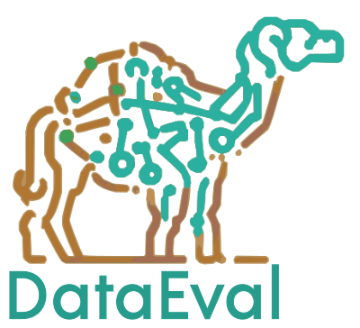

<!-- markdownlint-disable MD041 -->



<!-- :auto badges: -->

[](https://pypi.org/project/dataeval/)

[](https://dataeval.readthedocs.io/en/latest/?badge=latest)

<!-- :auto badges: -->

# DataEval

> DataEval analyzes datasets and models to give users the ability to train and
> test performant, unbiased, and reliable AI models and monitor data for
> impactful shifts to deployed models.

The `dataeval` package provides a rigorous and reliable set of tools for developing
and analyzing computer vision datasets and the resulting impact on models.

To view our extensive collection of tutorials, how-to's, explanation guides,
and reference material, please visit our documentation on
**[Read the Docs](https://dataeval.readthedocs.io/)**

## Why DataEval?

<!-- start needs -->

DataEval addresses the critical need underlying every AI model -- the data.
The difference between a great dataset and a poor dataset can have drastic
consequences on AI model performance. Data collected in the wild is noisy,
often imbalanced, and doesn't always cover the entire spectrum of conditions
need for deployment. DataEval provides AI practitioners with a library of
rigorous, algorithm-backed metrics for performance estimation, bias analysis,
dataset cleaning and assessment, and data distribution shifts. Throughout
all stages of the machine learning lifecycle -- from initial data collection
through operational monitoring -- DataEval identifies data problems before
they become model failures.

DataEval is easy to install, supports a wide range of Python versions, and is
compatible with many of the most popular packages in the scientific and T&E
communities.

<!-- end needs -->

### Target Audience

<!-- start JATIC interop -->

DataEval is intended to help data scientists, developers, and T&E engineers
who want to evaluate and enhance their datasets for optimum performance. For
users of the JATI product suite, DataEval has native interoperability when
using MAITE-compliant datasets and models.

<!-- end JATIC interop -->

---

## Getting Started

**Python versions:** 3.10 - 3.14

Choose your preferred method of installation below or follow our
[installation guide](docs/source/getting-started/installation.md).

- [Installing with pip](#installing-with-pip)
- [Installing with conda/mamba](#installing-with-conda)
- [Installing from GitHub](#installing-from-github)

### **Installing with pip**

You can install DataEval directly from pypi.org using the following command.

```bash
pip install dataeval
```

### **Installing with conda**

DataEval can be installed in a Conda/Mamba environment using the provided
`environment.yml` file. As some dependencies are installed from the `pytorch`
channel, the channel is specified in the below example.

```bash
micromamba create -f environment\environment.yml -c pytorch
```

### **Installing from GitHub**

To install DataEval from source locally on Ubuntu, pull the source down and
change to the DataEval project directory.

```bash
git clone https://github.com/aria-ml/dataeval.git
cd dataeval
```

#### **Using Poetry**

Install DataEval.

```bash
poetry install
```

Enable Poetry's virtual environment.

```bash
poetry env activate
```

#### **Using uv**

Install DataEval with dependencies for development.

```bash
uv sync
```

Enable uv's virtual environment.

```bash
source .venv/bin/activate
```

### Working with data

DataEval has two input paths depending on which part of the library you are using.

**`dataeval.core`** provides stateless functions that operate directly on NumPy
arrays — embeddings, labels, image hashes, and statistics. No dataset object is
required. Call these functions with arrays and get results back directly. Examples
include `compute_stats`, `label_errors`, `divergence_mst`, and `ber_knn`.

**`dataeval.quality`, `dataeval.bias`, `dataeval.shift`, and `dataeval.performance`**
provide stateful evaluator classes (`Duplicates`, `Outliers`,
`Prioritize`, `Balance`, drift detectors, and so on). These
accept either NumPy arrays or [Modular AI Trustworthy Engineering
(MAITE)](https://github.com/mit-ll-ai-technology/maite)-compliant datasets depending on the evaluator.

If your data is not yet in MAITE format, the sections below show what is
required and how to wrap a common format, for both image classification and
object detection tasks.

#### Image classification dataset

A MAITE-compliant image classification dataset implements `__len__` and
`__getitem__`, where each item is a tuple of `(image, label, metadata)`.
Images must be NumPy arrays of shape `(H, W, C)`. Labels must be one-hot
encoded arrays of shape `(num_classes,)`. Metadata must be a `DatumMetadata`
object with at minimum an `id` field.

```python
import maite.protocols as mp
import maite.protocols.image_classification as ic
import numpy as np


class MyImageClassificationDataset(ic.Dataset):
    metadata: mp.DatasetMetadata

    def __init__(self, images: list[np.ndarray], labels: list[int], num_classes: int) -> None:
        # images: list of np.ndarray, each shape (H, W, C)
        # labels: list of int (class indices)
        self._images = images
        self._labels = labels
        self._num_classes = num_classes

        self.metadata = mp.DatasetMetadata(
            id="my_image_classification_dataset",
            index2label={i: f"class_{i}" for i in np.unique(labels)},  # example mapping
        )

    def __len__(self) -> int:
        return len(self._images)

    def __getitem__(self, idx: int) -> tuple[ic.InputType, ic.TargetType, ic.DatumMetadataType]:
        return (
            self._images[idx],  # np.ndarray (H, W, C)
            np.eye(self._num_classes, dtype=np.float32)[self._labels[idx]],  # np.ndarray (num_classes,)
            ic.DatumMetadataType(id=idx),
        )
```

#### Object detection dataset

A MAITE-compliant object detection dataset follows the same three-tuple
structure, but the label element is replaced by a detection target object
carrying per-box labels, bounding boxes, and scores. Bounding boxes use
`(x0, y0, x1, y1)` format. Labels and scores are per-box, not per-image.

```python
import maite.protocols as mp
import maite.protocols.object_detection as od
import numpy as np


class DetectionTarget(od.TargetType):
    """Holds per-box labels, boxes, and one-hot scores for one image."""

    def __init__(self, labels: list[int], boxes: list[list[float]], num_classes: int):
        # labels: list of int, one per box
        # boxes:  list of [x0, y0, x1, y1], one per box
        self._labels = labels
        self._boxes = boxes
        self._scores = np.eye(num_classes)[labels]

    @property
    def labels(self) -> mp.ArrayLike:
        return self._labels

    @property
    def boxes(self) -> mp.ArrayLike:
        return self._boxes

    @property
    def scores(self) -> mp.ArrayLike:
        return self._scores


class MyObjectDetectionDataset(od.Dataset):
    def __init__(
        self, images: list[np.ndarray], labels: list[list[int]], boxes: list[list[list[float]]], num_classes: int
    ) -> None:
        # images: list of np.ndarray, each shape (H, W, C)
        # labels: list of list[int] — per-box class indices, one list per image
        # boxes:  list of list[[x0,y0,x1,y1]] — one list per image
        self._images = images
        self._labels = labels
        self._boxes = boxes
        self._num_classes = num_classes

        self.metadata = mp.DatasetMetadata(
            id="my_object_detection_dataset",
            index2label={i: f"class_{i}" for i in np.unique(labels)},  # example mapping
        )

    def __len__(self) -> int:
        return len(self._images)

    def __getitem__(self, idx: int) -> tuple[od.InputType, od.TargetType, od.DatumMetadataType]:
        return (
            self._images[idx],  # np.ndarray (H, W, C)
            DetectionTarget(self._labels[idx], self._boxes[idx], self._num_classes),
            od.DatumMetadataType(id=idx),
        )
```

#### Wrapping a PyTorch dataset

If your data is in a PyTorch `Dataset`, wrap it to conform to the MAITE
protocol. Note that `torchvision` tensors are `(C, H, W)` — permute to
`(H, W, C)` before passing to DataEval.

```python
import maite.protocols as mp
import maite.protocols.image_classification as ic
import numpy as np
import torch
from torchvision import transforms
from torchvision.datasets import CIFAR10

tv_cifar10 = CIFAR10(root="./data", train=True, download=True, transform=transforms.ToTensor())


class MyCIFAR10Wrapper(ic.Dataset):
    def __init__(self, source: CIFAR10) -> None:
        self._source = source
        self.metadata = mp.DatasetMetadata(
            id="tv_cifar10",
            index2label={
                0: "airplane",
                1: "automobile",
                2: "bird",
                3: "cat",
                4: "deer",
                5: "dog",
                6: "frog",
                7: "horse",
                8: "ship",
                9: "truck",
            },
        )

    def __len__(self) -> int:
        return len(tv_cifar10)

    def __getitem__(self, idx: int) -> tuple[ic.InputType, ic.TargetType, ic.DatumMetadataType]:
        tv_datum: tuple[torch.Tensor, int] = tv_cifar10[idx]
        image = tv_datum[0].permute(1, 2, 0).numpy()  # Permute image from (C, H, W) to (H, W, C)
        label = np.eye(10, dtype=np.float32)[tv_datum[1]]  # Convert label to one-hot encoding
        return image, label, mp.DatumMetadata(id=idx)


dataset: ic.Dataset = MyCIFAR10Wrapper(tv_cifar10)
```

### Run your first evaluation

The example below uses `Duplicates` from `dataeval.quality` to detect
near-duplicate images by finding groups of embeddings that are similar in
embedding space. Duplicates inflate benchmark scores and cause models to overfit
to repeated collection events rather than generalizing to new conditions.

```python
from torch.nn import Flatten

from dataeval.extractors import TorchExtractor
from dataeval.flags import ImageStats
from dataeval.quality import Duplicates

# Configure a feature extractor using a pre-trained PyTorch model.
# Here we use a simple Flatten layer for demonstration, but in practice
# you would use a more powerful model like a pre-trained ResNet or ViT.
extractor = TorchExtractor(Flatten())

# Find near-duplicates using only embedding-based clustering.
# An aggressive cluster_threshold of 1.5 should produce detections
# of near duplicates even with a simple Flatten extractor.
evaluator = Duplicates(
    flags=ImageStats.NONE,
    cluster_algorithm="hdbscan",
    cluster_threshold=1.5,
    extractor=extractor,
    batch_size=64,
)
result = evaluator.evaluate(dataset)

# Near duplicates are grouped into sets of indices that are within
# the specified cluster_threshold in embedding space.
print(result)
```

```text
shape: (3, 5)
┌──────────┬───────┬──────────┬────────────────┬─────────────┐
│ group_id ┆ level ┆ dup_type ┆ item_indices   ┆ methods     │
│ ---      ┆ ---   ┆ ---      ┆ ---            ┆ ---         │
│ i64      ┆ str   ┆ str      ┆ list[i64]      ┆ list[str]   │
╞══════════╪═══════╪══════════╪════════════════╪═════════════╡
│ 0        ┆ item  ┆ near     ┆ [18586, 39942] ┆ ["cluster"] │
│ 1        ┆ item  ┆ near     ┆ [23157, 31426] ┆ ["cluster"] │
│ 2        ┆ item  ┆ near     ┆ [32024, 49135] ┆ ["cluster"] │
└──────────┴───────┴──────────┴────────────────┴─────────────┘
```

A result with many large groups is a signal that your dataset contains
repeated collection events. Before training, remove all but one sample from
each group. See the [deduplication how-to guide](./docs/source/notebooks/h2_deduplicate.py)
for a complete walkthrough, including how to choose which sample to keep.

### Where to go next

Not sure what to evaluate first? Use the [Which tool should I use?](./docs/source/getting-started/which-tool.md)
guide to find the right evaluator for your situation.

Know which tool to use, then check out the [Functional Overview](./docs/source/reference/FunctionalOverview.md)
for a quick-reference table of each algorithm's inputs, outputs, and task applicability.

Want to just explore the documentation? The [Where to go next](./docs/source/getting-started/where-to-go-next.md)
page allows you to jump around between the different areas of the documentation with small summaries of what each page covers.

---

## Contact Us

If you have any questions, feel free to reach out to [us](mailto:dataeval@ariacoustics.com)!

## Acknowledgement

### CDAO Funding Acknowledgement

<!-- start acknowledgement -->

This material is based upon work supported by the Chief Digital and Artificial
Intelligence Office under Contract No. W519TC-23-9-2033. The views and
conclusions contained herein are those of the author(s) and should not be
interpreted as necessarily representing the official policies or endorsements,
either expressed or implied, of the U.S. Government.

<!-- end acknowledgement -->
