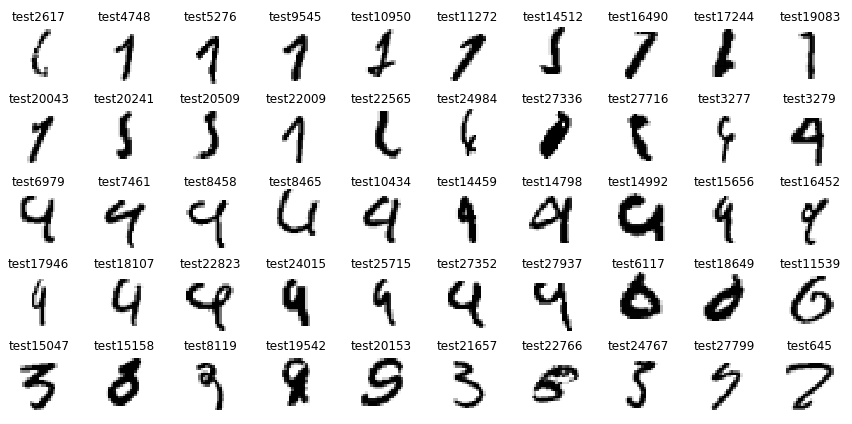
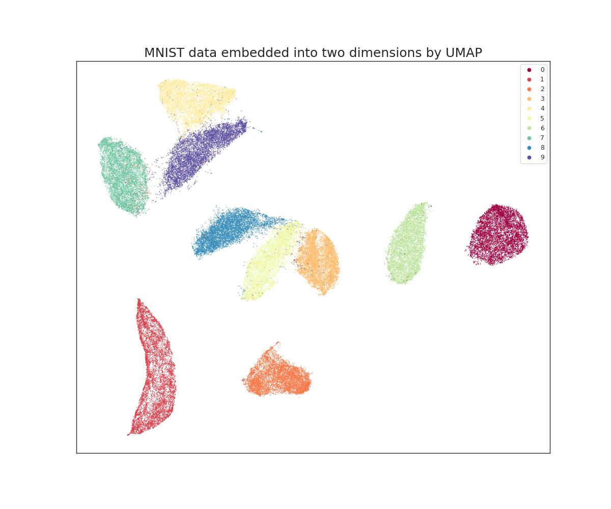

# Bayes Error Rate

## What is it

{term}`Bayes Error Rate<Bayes Error Rate (BER)>` or BER refers to the
{term}`irreducible error<Irreducible Error>` in a particular
{term}`classification<Classification>` problem. The `ber` function assesses the
{term}`feasibility<Feasibility>` of a machine learning classification task by
estimating this error rate. Bayes error rate has a formal definition given by
the following:

$$\text{BER}= E_X[P(Y\neq y \mid \argmax_i P(Y=i \mid X=x)=y)]$$

Put into words, it is the misclassification rate of the best possible classifier.

## When to use it

The `ber` metric should be used when you would like to measure the
{term}`feasibility<Feasibility>` of a
{term}`machine learning<Machine Learning (ML)>`
{term}`classification<Classification>` task.
For example, you would like to know if the operational
{term}`accuracy<Accuracy>` requirement of 80% is achievable given the imagery.

This quantity is of interest because it informs an engineer about the inherent
difficulty of a problem. If this difficulty surpasses operational performance
requirements, then the problem must be changed in order to become feasible.

## Theory behind it

While the expectation described above is easy to write down, it is nontrivial
to obtain it for difficult computer vision tasks. Many works have proposed
estimators of this quantity and analyzed their properties. At their core,
these estimators try to quantify uncertainty along the decision boundary. For
high dimensional datasets, typically only a fraction of samples are inherently
problematic when it comes to {term}`classification<Classification>`. For
example, take the following problematic images from the
[MNIST](https://en.wikipedia.org/wiki/MNIST_database) dataset (taken from
[here](https://www.kaggle.com/code/cdeotte/25-million-images-0-99757-mnist)):

It is very difficult for even a human to classify these images, and the
conditional distributions of labels for them are certainly non-deterministic.
This is an intuitive example of the
{term}`irreducible error<Irreducible Error>` that the `ber` function estimates.

One way of understanding how we try to estimate BER is to look at
*dimension reductions* of the images. In this case, we use
[UMAP](https://arxiv.org/abs/1802.03426) (a simple dimension reduction
technique) to embed the MNIST images in 2-dimensional space.

Here the colors represent the different labels (digits). While most are
separated, a small fraction of them are in the wrong cluster or lie in the
overlapping regions between clusters. These are the samples that contribute to
irreducible error.

The two methods we use to estimate BER are [K-nearest-neighbors] and a
[minimum spanning tree]. The technical details behind these estimators are
drawn from [Learning to Bound the Multi-class Bayes Error]. You can read this
paper for more technical details and justification pertaining to its
estimation.

The {func}`.ber` API will give more information on how to use the
functionality. The only parameter which is up to the user to select is $k$, the
number of neighbors to use for the BER estimator. We recommend $k=5$ as a
default. There are other options, such as $k=\sqrt{n}$ or $k=c_0 n^{4/(4+d)}$,
where $d$ is the number of features/dimension of the embedding, n is the
sample size, and $c_0$ is some constant. Both of these have empirical and
theoretical merits, but for most users, a relatively small, fixed $k$ is best.

[K-nearest-neighbors]: https://en.wikipedia.org/wiki/K-nearest_neighbors_algorithm
[minimum spanning tree]: https://en.wikipedia.org/wiki/Minimum_spanning_tree
[Learning to Bound the Multi-class Bayes Error]: https://arxiv.org/abs/1811.06419
