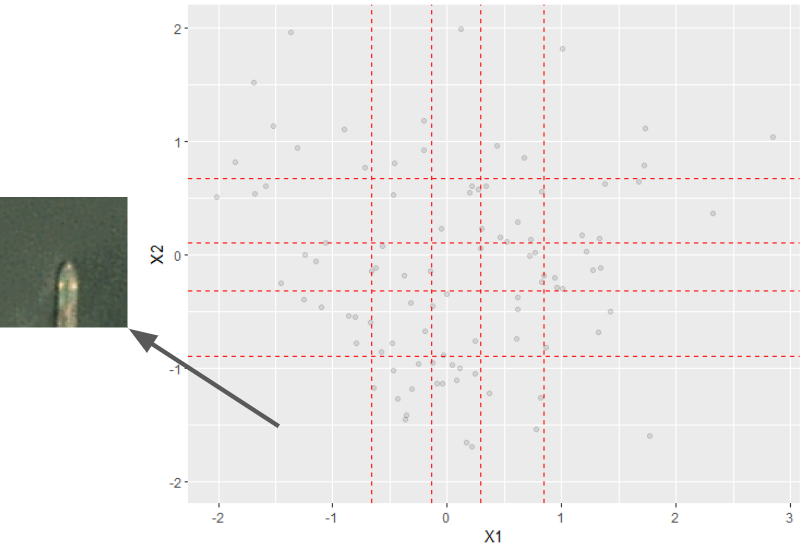

# Completeness

## What is it

{term}`Completeness` is a non-parametric diagnostic tool which evaluates the
degree to which a particular embedded dataset is complete and which regions
in particular are incomplete.

A complete dataset is one that contains enough combinations of intrinsic and
extrinsic factors to be representative and generalizable when conducting a
desired machine learning task. More precisely, data which are complete allow
the model to be trained on a wider variety of operationally-relevant contexts.

## When to use it

Completeness is used to determine which meta-feature values are
colinear with other meta-features or underrepresented in the dataset.
For example, consider a dataset that contains examples of both vans and cars,
where there are low and high-resolution vans, but only low-resolution cars.
In this scenario, a model may identify all low resolution vehicles as vans.

Users should investigate incomplete regions to determine if they are
problematic. For example, the above scenario would be problematic, but an
incomplete region containing flying cars in a dataset which also contains
planes would not be, as that combination does not correspond to operationally
relevant objects.

Users are able to differentiate between these scenarios by decoding
hypothetical embeddings from incomplete regions (as in the figure below).

## Theory behind it

Completeness, like many non-parametric data diagnostic tools, is rooted in
{term}`dimension reduction<Dimensionality Reduction>`. Once the user has a
lower dimensional embedding subspace, the tool evaluates the distribution of
the images within it.

The tool divides each embedding dimension into pieces based on its quantiles.
If a hyperrectangle contains no samples, Completeness gives the user its center
to investigate. Empty hyperrectagles warrant investigation because they
represent a missing combination of factors in the embedding space.

Completeness also reports the fraction of boxes which contain no samples.
A higher fraction implies that the data are complete and will generalize well.
A lower fraction implies that there are a significant number of metadata
combinations which are absent from the data.

In the below example, there is exactly one incomplete rectangle, then center of
which decodes to an image of a partially obfuscated ship. This informs a user
that such ships may not be present in the dataset.

Completeness does not determine if incomplete regions are problematic. Instead,
users can potentially view images from these regions to investigate themselves.

## API Reference

{func}`completeness <.completeness>`

## References

[1] Taejoon Byun and Sanjai Rayadurgam. 2020. _Manifold for machine learning
assurance_ from _ICSE-NEIR '20: Proceedings of the ACM/IEEE 42nd International
Conference on Software Engineering: New Ideas and Emerging Results_, 97–100.
[https://doi.org/10.1145/3377816.3381734](https://doi.org/10.1145/3377816.3381734)
