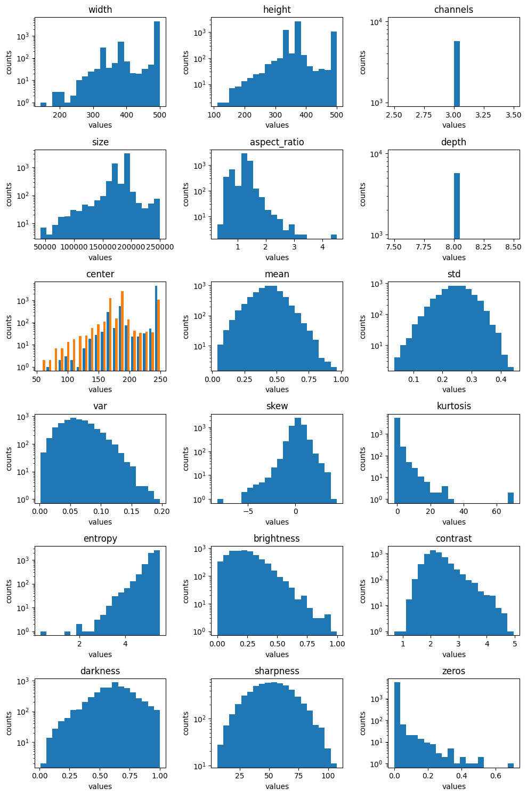
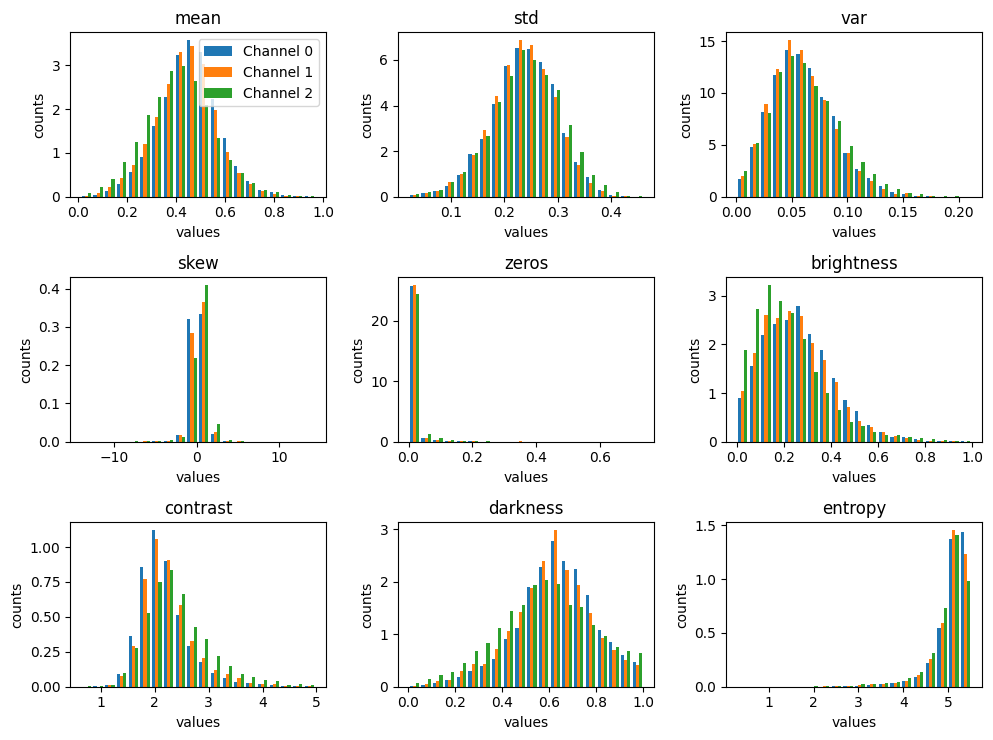

# Statistical Analysis

The image statistics functions assist with understanding the dataset.
These can be used to get a big picture view of the dataset and it's underlying
distribution. These functions create the data distribution that the Outlier
class uses to identify outliers.

## What are the statistical analysis functions

There are seven different DataEval stat functions for analyzing a dataset:

- `boxratiostats`
- `dimensionstats`
- `hashstats`
- `imagestats`
- `labelstats`
- `pixelstats`
- `visualstats`

The information below includes what each function does and the statistical
analysis metrics that are included in each function.

### boxratiostats

The {func}`.boxratiostats` function calculates the ratio of the bounding box
outputs to the image outputs.
This function can be used with the output from:

- dimensionstats
- pixelstats
- visualstats

This function requires both a bounding box output and an image output from the
above mentioned stat functions.

This function can be used in conjunction with the Outliers class to determine
if there are any issues with any of the images in the dataset.

### imagestats

The {func}`.imagestats` function provides an easy way to run the
dimensionstats, pixelstats, and visualstats on the images of a dataset or the
pixelstats, and visualstats over each channel of the images of a dataset.

### dimensionstats

The {func}`.dimensionstats` function is an aggregate metric that calculates
various dimension based statistics for each individual image:

- channels
- height
- width
- size - width * height
- aspect_ratio - width / height
- depth - automatic calculation of the bit depth of the image based on max and
  min image values
- left - the x value (in pixels) of the top left corner of the image or
  bounding box
- top - the y value (in pixels) of the top left corner of the image or
  bounding box
- center - the x and y value (in pixels) of the center of the image or
  bounding box
- distance - the distance between the center of the image and the center of the
  bounding box

This function expects the image in a CxHxW format and uses this standard format
to populate the width, height and channels metrics.

This function can be used in conjunction with the Outliers class to determine
if there are any issues with any of the images in the dataset.

### hashstats

The {func}`.hashstats` function is an aggregate metric that calculates various
hash values for each individual image:

- [xxhash](https://github.com/Cyan4973/xxHash) - exact image matching
- [pchash](https://en.wikipedia.org/wiki/Perceptual_hashing) - perceptual hash
  based near image matching

This function can be used in conjunction with the
Duplicates class in order to identify duplicate images.

### labelstats

The {func}`.labelstats` function provides summary statistics across classes
and labels:

- label_counts_per_class - total number of labels for each class
- label_counts_per_image - total number of labels for each image
- image_counts_per_label - total number of images for each label
- image_indices_per_label - dictionary tracking image number for each label
- image_count - total number of images
- label_count - total number of labels
- class_count - total number of class

### pixelstats

The {func}`.pixelstats` function is an aggregate metric that calculates normal
statistics about pixel values for each individual image:

- mean - average pixel value across entire image
- std - standard deviation of pixel values across entire image
- var - variance of pixel values across entire image
- skew - measure of how normally distributed the data is
- kurtosis - measure of how normally distributed the data is
- entropy - Shannon entropy based on the histogram, $-\sum p \log p$
- histogram - scales pixel values between 0-1 and binned into 256 bins

This function can be used in conjunction with the Outliers class to determine
if there are any issues with any of the images in the dataset.

### visualstats

The {func}`.visualstats` function is an aggregate metric that calculates visual
quality statistics for each individual image:

- brightness - the value of the 25th percentile
- sharpness - the standard deviation of a 3x3 edge filter
- contrast - max value - min value / mean value
- darkness - the value of the 75th percentile
- missing - total number of pixels missing a value as a
  percentage of total pixels
- zeros - total number of pixels with a zero value as a
  percentage of total pixels
- percentiles - 0, 25, 50, 75, 100 percentile values

This function can be used in conjunction with the Outliers class to determine
if there are any issues with any of the images in the dataset.

## When to use the statistical analysis functions

The functions are automatically called when using `Outliers.evaluate` on data.
Therefore, the functions themselves don't usually need to be called on the data.
However, there are a few scenarios that lend themselves to using the functions
independently:

- When multiple sets of data as well as the combined set are to be analyzed,
  it can be easier to run the stat functions on each individual set of data
  and then pass in the outputs to the Outlier class in each of the desired
  data combinations for analysis.
- When comparing the resulting data distribution between two or more datasets
  to determine how similar the datasets are.
- When visualizing the resulting data distribution after using one or more
  of the stat functions.

### Example visualizing the resulting data distribution

The output for each function contains a `plot` function which plots
a histogram of the data results, except for the `hashstats` function whose
results are grouped lists and has no visualization function, and the
`labelstats` function whose results can be visualized instead with the
`to_table` function.

Example code and result for the `datasetstats` function:

```python
# Load the statistic metric from DataEval
from dataeval.metrics.stats import datasetstats

# Loading in the PASCAL VOC 2011 dataset for this example
to_tensor = v2.ToImage()
ds = VOCDetection(
    "./data",
    year="2011",
    image_set="train",
    download=True,
    transform=to_tensor,
)

# This stat function takes about 1-3 minutes to run depending on your hardware

# Calculate the datasetstats for the images
# Note: the stat function expects the images as an iterable
#       and in the (C,H,W) format
stats = datasetstats(d[0] for d in ds)

# Visualize the results
stats.plot(log=True)
```



Example code and result for the `channelstats` function:

```python
# Load the statistic metric from DataEval
from dataeval.metrics.stats import channelstats

# Loading in the PASCAL VOC 2011 dataset for this example
to_tensor = v2.ToImage()
ds = VOCDetection(
    "./data",
    year="2011",
    image_set="train",
    download=True,
    transform=to_tensor,
)

# This stat function takes about 1-3 minutes to run depending on your hardware

# Calculate the datasetstats for the images
# Note: the stat function expects the images as an iterable
#       and in the (C,H,W) format
ch_stats = channelstats(d[0] for d in ds)

# Visualize the results
ch_stats.plot(log=False, channel_limit=3)
```



#### Using the visualization for a quick analysis

Visualizing the distribution of values for each metric allows one to
quickly inspect the metrics for unusual distributions. In general, each
metric should follow either a normal distribution or a uniform distribution.

With a [uniform distribution](https://en.wikipedia.org/wiki/Discrete_uniform_distribution),
you want to notice if any of the plots have areas that are a lot shorter
or a lot taller than the rest of the values.

With a [normal distribution](https://en.wikipedia.org/wiki/Normal_distribution),
you are looking at the edges of the bell curve to see if the values
near the edges of the plot raise up or if there are gaps between the
edge values and the next value in.

When analyzing the visualizations by channel, you should not be interested in
the overall shape of these plots but in the comparison of the shape
across each of the individual channels.
You want to see if the same shape holds across each channel or if
there are large differences between the channels.
This is important because discrepancies across channels can help
detect image processing errors and channel bias.

For example, below is a quick analysis of the above example plots.

In regards to the datasetstats plot, there are a few key insights:

1. The channel metric has only one value, 3, which is interesting since
some of the images in the dataset are greyscale, and greyscale images
usually only have 1 channel.
2. The entropy, zeros, kurtosis, and contrast metrics are single-tailed
and all of them have a long tail which indicates that the images whose
values are in the edges of the tail are potentially problematic.
3. Size, aspect ratio, variance, skew, brightness and darkness have skewed
or off-center distributions which is another sign of problematic images.
4. Mean, standard deviation and sharpness appear to have a normal
distribution and none have an extended tail, which is a good sign.

While these insights don't identify the exact images that may be
problematic, they highlight where to focus on with further analysis.

In regards to the channelstats plot, the only insight is that there
is very little difference across the channels for each metric.
Therefore, there are no additional concerns beyond those from the
datasetstats plot.
