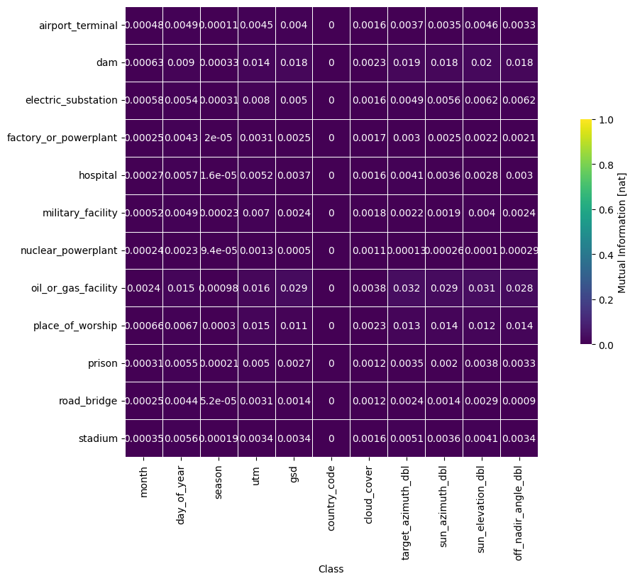
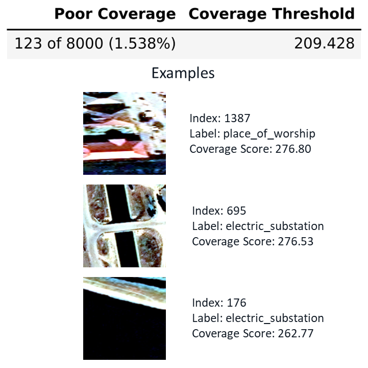

# Artificial intelligence engineer workflow

In this workflow, we will describe how an
{term}`artificial intelligence<Artificial Intelligence (AI)>` engineer can use
DataEval, and which components of our toolkit are suitable for their use. The
AI engineer interacts with DataEval at the data engineering, model development,
and monitoring stages of the AI/ML lifecycle.

## Data engineering

First, in the **data engineering** stage, AI engineers assess the quality of
the data for the desired task. For example, if a higher percentage of image are
difficult to classify, and the operational requirements are high, the problem
may need to be reformulated or reposed, or additional data will need to be
collected. The diagnostic part of this stage is sometimes called
*exploratory data analysis* (EDA). The AI engineer can make decisions with
respect to problem feasibility or data hygiene following EDA.

AI Engineers can first analyze raw datasets through the *linting* feature.
<!---TODO: Link the relevant tutorials/how-tos.--> This tool will identify
images which are too dark, too blurry, etc. The AI Engineer can then decide if
these images are acceptable as is, or ought to be edited/removed from the
dataset. The point of dataset linting is to identify qualitative patterns in
the image data that may impact model training downstream. In cases where
substantial issues exist in some images, they can be filtered out or adjusted
in some way. An example output of linting can be seen below:

In this case, some of the bright and dark images in particular are nearly
unusable, and would be very difficult for even a knowledgeable human to
identify. Other quality extremes are less problematic.

Following basic dataset linting and analysis of the images themselves, AI
engineers can perform metadata analyses, checking if certain metadata factors
are imbalanced or are associated with label. They can do this via the
*classwise balance* and *diversity* features. The former checks if individual
class labels and image metadata factors have strong *mutual information*, a
measure of association. The latter measures if there is sufficient metadata
spread within each class label distribution.

Both of these metrics tell the AI engineer if there are potentially problematic
interactions between image metadata and label. High or low values for these
metrics could imply systemic undersampling in certain image subcategories. In
such cases, a AI engineer may want to up- or downsample certain image classes
or metadata factors to maintain {term}`balance<Balance>`. Examples outputs for
these metrics can be seen below:

In this particular case, there seems to be quite low
{term}`diversity<Diversity>` in cloud coverage, but this pattern is repeated
across all classes. This tells the AI engineer that perhaps some data
preprocessing has been done with respect to this metadata factor.

Following these and potentially other analyses, the AI Engineer passes off the
dataset for corresponding model development.

## Model development

The main responsibility of an AI engineer, and what differentiates them from
others, is the selection and development of an AI/ML model for a desired task.
Firstly, an AI engineer must determine if a model is *sufficient* for a given
task. They can do this by estimating model performance on a dataset, and
extrapolating that estimate out to the target dataset size. If the resulting
estimate exceeds requirements, that is a good indication to the AI engineer
that the model is sufficient for the task. An example visualization of this
{term}`sufficiency<Sufficiency>` check can be seen below:

In this example, it is clear that ResNet outperforms AlexNet at a given sample
size.

One other value displayed above is the maximum attainable performance. This
value can be calculated by the AI engineer, and is an estimate of the maximum
possible performance that a model could achieve given the complexity of the
underlying task. Models can approach, but generally will not surpass, this
estimate.

Following these analyses, the AI engineer would use the processed data from the
above section, and the selected model from this section, to train and deploy a
{term}`machine learning<Machine Learning (ML)>` model to perform the desired
task. This model is now intelligently selected from candidate architectures,
and is trained on a dataset which has been carefully checked for potential
errors/{term}`bias<Bias>`.

## Monitoring

As an AI engineer, one is also responsible for *monitoring* deployed models.
The purpose of the monitoring stage is to ensure that the data the model is
being applied to resemble those on which the model was trained. It is not
necessary for these data to be identically distributed, merely that differences
between training and operational data will not affect performance. Detection of
dataset {term}`drift<Drift>` or anomalous images can indicate to the AI
engineer that additional training, or complete retraining, will need to occur
in order for the model to perform similarly to test set performance.

There are several tools an engineer can leverage to analyze and evaluate the
performance of a deployed model, and potential changes in operational data. The
first of these tools is *coverage*. {term}`coverage<Coverage>` tells the AI
engineer which images in the operational set have few other images which are
similar to it. Such images can tell an AI engineer which image factors may be
undersampled in operational data. This is critical as regions of the image
space that were densely sampled in the training data, and therefore fit quite
accurately, may not correspond to regions that are densely sampled in the
{term}`operational dataset<Operational Dataset>`. Such a difference can lead to
performance degradation *even if* the operational environment itself has not
changed. An example of a coverage output can be seen below:

In this example, the AI engineer was able to identify high-contrast electric
substations as a potentially problematic subclass in the operational dataset.

Another image assessment tool is *out of distribution* (OOD) detection. This
tool detects images which look entirely dissimilar to those on which the model
was trained. Such images can indicate to an AI engineer that there has been a
qualitative shift in image distribution, or that a new, operationally relevant
class has emerged. An example OOD output can be seen below:

Here, we can see that a new type of powerplant, a solar farm, has emerged in
the operational dataset. This type of powerplant was not present in the
training set, and is therefore flagged as
{term}`out of distribution<Out-of-distribution (OOD)>`. This would constitute
a retraining event for the AI engineer.

Finally, the AI engineer can look at overall *dataset drift*. DataEval has
several tests which determine if the operational dataset is significantly
different from the training data. Such changes are known to be associated with
performance degradation, so the AI engineer would trigger retraining as a
result of significant drift. An example output can be seen below:

These results indicate that the operational set has shifted substantially, a
result confirmed but some of the analyses above. Such indications should tell
the AI engineer that the model should be retrained.

With all of these tools in DataEval, an AI engineer can conduct analyses at
multiple stages of the AI/ML lifecycle.
